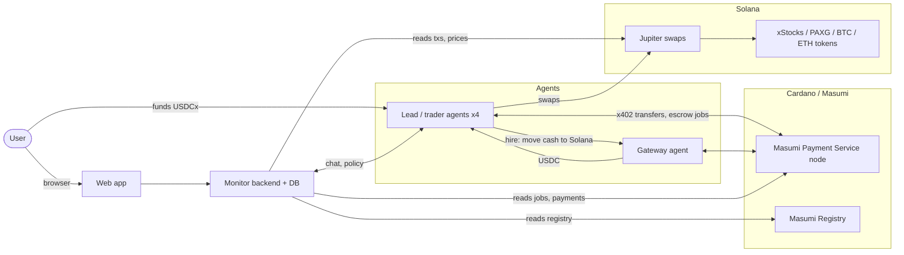

# HedgeAgents on Masumi — build plan

Agents that trade real tokenized markets for a user, get paid and move budget between each other on Masumi (Cardano), and show every step in a web app.

Inspired by HedgeAgents (arXiv:2502.13165, specialists + budget allocation) and `virattt/ai-hedge-fund` (hash-chained ledger, hard risk limits, LLM personas). Both are references, not dependencies.

## 1. What we're building

**Mode 1 — foundation**
- One **trader agent** trades one market the user picks: tokenized gold, tokenized stocks, ETH, or BTC.
- The user gives it a budget.
- A **gateway agent** connects it to that market. Masumi lives on Cardano; the liquid markets for these tokens live on Solana. The gateway moves money between the two.
- Goal: grow the user's budget. Success is measured as net profit after every fee, against simply holding the same asset.

**Mode 2 — team**
- Four trader agents, one per market: gold, stocks, ETH, BTC.
- The user funds one agent (the **lead**) with the whole budget; the team splits it.
- Each round the agents compare performance and move budget between their wallets: more to whoever is earning, back again when that run ends.
- All agent-to-agent transfers go through Masumi.

**Web app**
- Profile with stats: performance, fees, gross profit, net profit.
- Audit trail of every transaction, with links to the blockchain explorers.
- Mode 2: one chart with each agent's value over time, so you can see where money moved and whether it paid off.
- Chat with the agents to adjust strategy and how budget is split.

## 2. Decisions (defaults chosen; change here if needed)

| # | Decision | Default | Why |
|---|---|---|---|
| D1 | Where trading happens | Solana mainnet via Jupiter, for all four markets | Cardano has no tokenized stocks; its BTC/ETH pools are tiny (iBTC/ADA about $104K liquidity, about $5/day volume) |
| D2 | Masumi network | Develop on **Preprod** (free test tokens); go live on **Mainnet** (USDCx stablecoin) | Real trades need real money on both sides; on Preprod the gateway would be turning worthless test tokens into real USDC |
| D3 | Budget transfers between agents | **Masumi x402 direct payments** in USDCx | Final in about 20 s, about 0.17 ADA (~$0.03), no 5% Masumi fee |
| D4 | Paid services (gateway, reports) | **Masumi escrow jobs** (MIP-003) | Refunds, dispute window, decision log. 5% fee applies only to the service fee, never to capital |
| D5 | Gateway role | **Bridge only**: moves cash Cardano ↔ Solana. Traders place their own swaps | One escrow job per trade costs about 1.8 ADA (~$0.35) plus 5%; per-trade fees would eat small budgets |
| D6 | Who places trades | Each trader signs its own Jupiter swaps from its own Solana wallet | Chosen earlier. Hard limits in code (section 8) |
| D7 | Who decides allocation | A fixed formula proposes, agents may object with reasons, limits in code cap every move | Keeps budget moves explainable and stops agents passing money around in circles |
| D8 | Agent framework | Python, `pip install masumi` (FastAPI service with Masumi's job and payment endpoints built in) | Official SDK; same language as `ai-hedge-fund` |

**Alternative to D3 (fallback if it's too slow in practice):** keep cash on Solana and move USDC between agents there (seconds, under $0.01), recording each allocation decision as a Masumi job with a decision-log hash. Cheaper and faster, but the transfers themselves wouldn't be on Masumi.

## 3. Architecture

**Each trader agent has:**
- A Masumi identity (registry entry) and a Cardano wallet holding USDCx for budget, plus ADA for fees.
- A Solana wallet holding USDC, the traded token, and a little SOL for fees.
- A strategy for one market, an LLM for market views, and code that sizes trades and enforces limits.

**The gateway agent has:**
- USDCx on Cardano and USDC on Solana, pre-funded by us. It's a small market maker between the two chains.
- Two Masumi jobs: `deposit_to_solana` and `withdraw_to_cardano`.

## 4. Money flows

### Mode 1

1. **Fund.** The user sends USDCx to the trader's Cardano wallet, either through a connected wallet in the web app or by plain transfer.
2. **Move to Solana.**
   - The trader sends the capital to the gateway with an x402 direct payment.
   - It then hires the gateway with an escrow job whose input carries that payment's tx id and the trader's Solana address.
   - The gateway sends the same amount in USDC on Solana, minus its fee, and returns the Solana tx signature as the job result.
   - If nothing arrives before the deadline, the trader requests a refund.
3. **Trade.** The trader swaps USDC ↔ market token on Jupiter, within its limits.
4. **Cash out.** The trader sells to USDC and hires `withdraw_to_cardano`. The gateway sends USDCx to the trader on Cardano, and the trader pays it to the user with x402.

### Mode 2 — rebalance round (default D3)

1. A giving agent sells part of its position to USDC and withdraws it to Cardano through the gateway.
2. It sends that amount to the receiving agent with an x402 direct payment on Masumi.
3. The receiver deposits it to Solana through the gateway and buys its token.
4. **Buffer:** each agent keeps about 10–20% of its share as USDCx on Cardano, so small moves skip the gateway entirely.

### Cost per rebalance move (estimates, ADA ≈ $0.20)

| Item | Cost |
|---|---|
| x402 transfer | About 0.17 ADA (~$0.03) |
| Gateway escrow job, ×2 for withdraw + deposit | About 1.8 ADA each (~$0.35), plus 5% of the gateway fee |
| Gateway fee | We set it, e.g. 0.1% |
| Jupiter swap | Price impact: about 0.1% (SPYx) to about 1.3% (AAPLx) on $100k sells; small for demo sizes |
| Solana transactions | Under $0.01 |
| Latency | Masumi detects payments in about 1–7 min, so a full move takes about 10–20 min |

**Consequence:** with a $50 budget per agent, one move costs about 1.5% in fixed fees. Plan on at least $100–250 per agent and few rebalances.

## 5. Agents

### Trader agent (one codebase, configured per market)

| Market | Solana tokens (verify mints, section 11) | Signal ideas |
|---|---|---|
| Gold | PAXG (and XAUT if on Solana) | Trend, dollar strength, crash days |
| Stocks | xStocks: SPYx, QQQx, NVDAx, TSLAx (the most liquid) | `ai-hedge-fund` personas and fundamentals (needs a Financial Datasets key), earnings drift |
| ETH | Wrapped ETH on Solana | Trend / volatility regime, news via LLM |
| BTC | cbBTC or WBTC on Solana | Same |

**Loop, every N minutes:**
1. Pull prices and news.
2. The LLM forms a view (conviction −1…+1 plus reasoning).
3. Code turns the view into a target position, checks limits, and swaps on Jupiter.
4. Log the decision.

**Masumi jobs it sells:**
- `report`: performance over a window, current position, and its reasoning. Used in allocation rounds and the audit.
- `accept_budget` (mode 2): the receiver confirms it got the transfer.

### Gateway agent
- `deposit_to_solana(amount, x402_tx_id, solana_address)` → Solana tx signature.
- `withdraw_to_cardano(amount, solana_tx_sig, cardano_address)` → Cardano tx id.
- Rejects jobs it can't fill from inventory, before payment locks.
- Inventory alert when either side drops below a threshold; topping up is manual.

### Lead (mode 2)
- Any trader can be lead. The lead takes the user's deposit, runs allocation rounds, and pays the user out.
- The lead keeps trading its own market too.

## 6. Allocation protocol (mode 2)

Each round, every 30 min for the demo, daily for real:

1. **Reports.** Each agent publishes its `report` (value, return over the window, volatility, drawdown) as a Masumi job. The hashed report goes into the audit trail.
2. **Score.** Code computes a risk-adjusted score per agent: decayed recent return ÷ volatility, with a penalty for big drawdowns. The decay means a winning run fades out on its own.
3. **Propose.** Target weights proportional to score, with hard caps:
   - Each agent stays between 10% and 50% of the total.
   - No agent's share moves more than 10 points per round.
   - No move under 5 points of change (stops churn).
   - At least 2 rounds of cooldown before the same agent can move again.
4. **Council.** Each agent's LLM may object with a reason (e.g. "my drop is a one-day crash, I'm already recovering"). The lead may adjust weights within the caps; every objection and adjustment is logged.
5. **Execute.** Transfers per section 4. The round record lists the weights before and after, every transfer tx, and the reason.

**User policy** from chat (section 7) feeds into steps 3–4: caps per agent, paused agents, risk level.

## 7. Backend and web app

### Monitor backend (FastAPI + Postgres)

**Reads from:**
- The Masumi Payment Service API (jobs, payments, purchases, refunds) and the Masumi Registry.
- Cardano transactions (through the payment service's Blockfrost connection).
- Solana transactions and balances (RPC) and Jupiter prices.

**Tables:**
- Who and where: `agents`, `wallets`.
- Money movement: `masumi_jobs`, `transfers`, `trades`, `allocation_rounds`.
- Valuation: `prices`, `value_snapshots`, which hold each agent's total value per minute.
- User control: `policies`, which are versioned and hashed, and `chat_messages`.
- Audit: `events`, an append-only log where each entry carries the hash of the previous one (the `ai-hedge-fund` ledger idea).

**Computes:**
- Per agent and in total: value over time, gross profit, and net profit.
- Fees split into Cardano ADA fees, Masumi 5%, gateway fees, swap price impact, and Solana fees.

### Web app (Next.js + a chart library)

**Profile:**
- Total value, deposits, gross and net profit, fees by type, return compared with just holding the asset.

**Audit:**
- Every event in time order: decision, job, transfer, trade.
- Each row shows amounts, the reason, its hashes, and links to the Cardano and Solana explorers.

**Team chart (mode 2):**
- One line per agent's value, plus the total.
- Markers at allocation rounds.
- A dashed "no reallocation" line: the same agents at their starting split. This is approximate, built from each agent's % returns, and it's what shows whether redistribution actually helped.

**Chat:**
- Questions ("why did BTC get more?") are answered from backend data.
- Instructions ("less risk", "cap stocks at 20%", "pause ETH") make the lead's LLM draft a **policy change**. The app shows it as a before/after; the user confirms; it's stored as a new policy version that agents apply from the next round.
- Chat never moves money directly.

## 8. Safety limits (in code, not prompts)

- **Allowed tokens:** a fixed list of Solana token addresses per agent; anything else is rejected.
- **Trade limits:**
  - Maximum trade size: % of the agent's value and an absolute $ cap.
  - Maximum slippage per swap.
  - Daily loss stop: an agent that loses X% in a day pauses itself.
- **Fund-wide kill switch:** one button in the web app and one API call. It stops trading and allocation; withdrawal is manual.
- **Gateway caps:** maximum amount per job and per day.
- **Keys:** one key per agent from secrets, never in prompts or logs.
- **Size:** small balances until the escrow and gateway flows have run cleanly end to end.

## 9. Phases

The minimum demo is phases 0–2 plus the profile and audit pages. Cut in this order if time runs out: chat, then the "no reallocation" line, then the ETH/BTC agents.

### Phase 0 — setup

**Tasks:**
- Monorepo:
  - `agents/`: shared code, `trader/`, `gateway/`.
  - `monitor/`: backend.
  - `web/`: web app.
  - `infra/`: docker-compose with the Masumi payment service and Postgres.
- Masumi payment service on Preprod, with its admin key and a Blockfrost key.
- Register the gateway and one trader agent in the registry.
- Solana: RPC endpoint and one wallet per agent; fund with small USDC + SOL.
- LLM API key. Optionally a Financial Datasets key for the stocks agent.
- Verify the Solana token addresses for every market (section 11).

**Done when:** both agents show in the Masumi registry on Preprod, and a test job runs end to end (payment locked → result → funds released).

### Phase 1 — mode 1

**Tasks:**
1. Gateway: `deposit_to_solana` / `withdraw_to_cardano`, with inventory checks and refunds when not delivered.
   - On Preprod, the Solana side is a capped $1 transfer from the gateway's own wallet.
2. Trader: one market (start with stocks or gold), the trading loop, Jupiter swaps, limits, and the `report` job.
3. User funding (x402 to the trader) and cash-out.
4. Backend: read jobs, transfers, and trades; compute value and fees.
5. Web app: profile and audit pages.
6. Switch to Masumi Mainnet with $50–100.

**Done when:** the user funds → the trader moves cash to Solana → buys → sells → cashes out. Every step shows in the audit with explorer links, and net profit matches the wallet balances.

### Phase 2 — mode 2

**Tasks:**
1. Four trader agents from one codebase, each with its own config, wallets, and registry entry.
2. The lead receives the user's deposit and makes the first split.
3. Allocation rounds per section 6, with transfers per section 4 (buffer first, gateway only when needed).
4. Team chart with round markers.

**Done when:** at least 3 rounds run live; a strong agent visibly gains share and later gives it back; every move is in the audit with its reason and tx links.

### Phase 3 — chat and strategy control

**Tasks:**
- Chat endpoint → lead LLM → draft policy change → user confirms → new policy version.
- Data questions answered from the backend.
- "No reallocation" comparison line.

**Done when:** "cap stocks at 20%" visibly applies in the next round.

### Phase 4 — demo hardening

**Tasks:**
- Start live trading as early as possible, so the chart has hours of real data by demo time.
- Kill switch tested.
- Gateway inventory topped up.
- A recorded walkthrough as backup in case the network fails on stage.

## 10. Demo script (about 3 min)

1. The profile page shows the user funded the lead with $X USDCx (Cardano tx link).
2. The audit shows the gateway job: the escrow payment locked, the Solana delivery signature returned, the payment released.
3. The team chart: four lines, with markers where budget moved. Click a marker to see the reasons and transfers.
4. In chat, the user says "cap BTC at 20%"; confirm the policy change; the next round applies it.
5. Net profit after fees, against just holding the assets. Be honest: a few hours of returns are mostly noise. The demo shows the mechanism, not proof of an edge.

## 11. To verify before building on it

- [ ] Solana token addresses and liquidity for BTC (cbBTC / WBTC), ETH (wrapped ETH), PAXG, XAUT on Solana, and the chosen xStocks.
- [ ] Whether x402 with `assetTransferMethod: "masumi"` (escrow-backed) charges the 5% fee. If not, use it for capital transfers to gain refund protection.
- [ ] USDCx on Masumi Mainnet: where we get it and how the gateway restocks it.
- [ ] Masumi registry cost per agent on Mainnet (about 1.5 ADA plus about 1.5 ADA locked with the agent's registry token).
- [ ] Hackathon rules: is Masumi required, or only a partner track?
- [ ] xStocks eligibility: not offered to US persons; check the funder's country.
- [ ] Jupiter API limits and keys for automated swaps.
- [ ] Masumi Hydra layer-2: announced Jan 2026, not confirmed live. Ignore for the hackathon.

## 12. References

- HedgeAgents paper: `~/Downloads/2502.13165v1.pdf`
- `ai-hedge-fund` clone: `_references/ai-hedge-fund/`
- Masumi docs: https://www.masumi.network/dev/masumi/documentation
- Masumi payments and escrow: https://www.masumi.network/dev/masumi/core-concepts/payments
- Masumi x402: https://www.masumi.network/dev/masumi/core-concepts/x402
- Masumi transaction fees: https://docs.masumi.network/core-concepts/transaction-fees
- Masumi Python SDK: https://github.com/masumi-network/pip-masumi
- xStocks: https://xstocks.fi/
