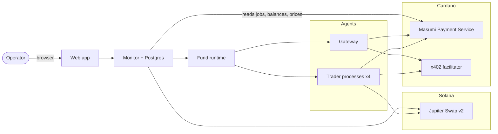

# HedgeAgents on Masumi — build plan

Agents that trade real tokenized markets for a user, get paid and move budget between each other on Masumi (Cardano), and show every step in a web app.

Inspired by HedgeAgents (arXiv:2502.13165, specialists + budget allocation) and `virattt/ai-hedge-fund` (hash-chained ledger, hard risk limits). Both are references, not dependencies. The hedge-fund repo was rewritten in August 2026; the ledger and the limits we copy are in v2 (`hedge_fund/paper/ledger.py`, `hedge_fund/risk/limits.py`), not the deleted `src/agents` tree.

The spec that implementation follows is:

- [docs/DECISIONS.md](docs/DECISIONS.md) — what changed from the first draft of this file, and why.
- [docs/ARCHITECTURE.md](docs/ARCHITECTURE.md) — processes, wallets, money, trading, allocation, data, web, failures, phases.

Where this file and those two disagree, the docs win. The numbers below are the corrected ones.

## 1. What we're building

**Mode 1 — foundation**
- One **trader agent** trades one market the user picks: tokenized gold, tokenized stocks, ETH, or BTC.
- The user gives it a budget.
- A **gateway agent** connects it to that market. Masumi lives on Cardano; the liquid markets for these tokens live on Solana. The gateway moves money between the two from inventory it already holds. There is no live Cardano–Solana bridge in the trade path.
- Goal: grow the user's budget. Success is measured as net profit after every fee, against simply holding the same asset.

**Mode 2 — team**
- Four trader agents, one per market: gold, stocks, ETH, BTC.
- The user funds one Cardano address with the whole budget. The fund runtime splits it. That address is not allowed to rewrite the weights.
- Each round, code compares performance and moves budget between wallets: more to whoever is earning, back again when that run ends.
- Agent-to-agent **capital** moves as Cardano x402 payments (Masumi's direct payment rail). Service fees and reports are Masumi escrow jobs. Capital is never the escrow price.

**Web app**
- Profile with stats: performance, fees, gross profit, net profit.
- Audit trail of every transaction, with links to the blockchain explorers, and a hash chain whose head is anchored in a Masumi report.
- Mode 2: one chart with each agent's value over time, so you can see where money moved and whether it paid off.
- Chat with the fund to adjust strategy and how budget is split. Chat writes a policy. It does not sign.

One operator, one fund. No accounts.

## 2. Decisions

Checked 8 October 2026. Evidence and the rejected alternatives are in [docs/DECISIONS.md](docs/DECISIONS.md).

| # | Decision | What we build | Why this and not the first draft |
|---|---|---|---|
| D1 | Where trading happens | Solana mainnet via Jupiter Swap v2, for all four markets | Kept. Mints are verified; see section 5. |
| D2 | Networks | Two environments that never mix. **Preprod:** Masumi Preprod, tUSDM, Solana devnet, protocol wiring only. **Mainnet:** Masumi mainnet, USDCx, Solana mainnet, real PnL. | Preprod cannot prove profit. Devnet Jupiter does not have these markets. USDCx is Circle xReserve, live since 27 Feb 2026. |
| D3 | Budget transfers | Cardano x402 `exact`, `assetTransferMethod: "default"` (wallet to wallet), via a small Node facilitator. About one block. No Masumi fee. | The Payment Service and the Python SDK do not expose Cardano x402. Their `/x402` API is Base. The escrow variant of x402 cannot be completed by our payment-service node, so it is forbidden for capital. |
| D4 | Paid services | MIP-003 escrow on the **V2** contract, price = the flat fee only. Shortest unlock is about 45 minutes. Our REST client sets those deadlines. | V2's fee rate is 0 today (`feeRatePermille: 0`). Docs still say 5% of the price. Keeping capital out of the price is what stops a future 5% from skimming it. There is no 1.8 ADA constant. The SDK's 12h/24h deadlines are not used. |
| D5 | Gateway role | Inventory only: `deposit_to_solana` and `withdraw_to_cardano`. Traders swap themselves. Sends the other chain only after the inbound payment has one confirmation. | Kept. Escrow around every swap is still too slow for a $100 book, even without the old fee figure. |
| D6 | Who places trades | Each trader signs its own Jupiter swaps from its own Solana wallet | Kept. Allowlisted mints. Limits in section 8. |
| D7 | Who decides allocation | Deterministic code in the fund runtime. An LLM objection applies only when it names a rule the code can recompute. It cannot raise its own weight. | A trader that can edit weights will argue for itself. The old 10-point cap plus a 2-round cooldown made the phase 2 demo impossible. |
| D8 | Stack | Python 3.11. `masumi` SDK for the MIP-003 HTTP shell only. Cardano keys in the Payment Service and the facilitator. Solana keys only in trader and gateway processes. | The SDK is not a wallet and not an x402 client. |

**Fallback if the x402 facilitator is not signing on demo day:** `POST /wallet/transfer-funds` on the Payment Service (plain Cardano tx, minimum 2 ADA, admin key). The audit labels those rows as plain transfers, not escrow. Moving the budget on Solana and only hashing the decision into a Masumi job does **not** meet the requirement that the payments themselves go through Masumi.

## 3. Architecture

The component diagram, wallet layout, and request paths are in [docs/ARCHITECTURE.md](docs/ARCHITECTURE.md). Short version:

**Each trader** has a Masumi registry entry, a Cardano hot wallet (USDCx or tUSDM, plus ADA for fees and a 5 ADA collateral UTxO), and a Solana wallet (USDC, the one allowlisted token, a little SOL). The fund runtime is the only scheduler. The trader re-checks limits before it signs.

**The gateway** holds USDCx on Cardano and USDC on Solana, funded by us before the demo. Wanchain's Cardano route has been down since the 20 July 2026 exploit. xReserve mint is about 15–25 minutes and the burn back is about 2 hours, so restocking is manual and not part of a trade.

**Payment Service settings that matter:** V2 only, and poll intervals at the code defaults (`CHECK_TX_INTERVAL` 20s, `BATCH_PAYMENT_INTERVAL` 30s, 1 confirmation). The upstream `.env.example` is 180s / 240s / 20 confirmations, which makes every payment look stuck. List calls must filter `Web3CardanoV2` or V2 rows are hidden. One payment-service instance hosts every agent's wallets.

## 4. Money flows

### Mode 1

1. **Fund.** The operator sends USDCx to the trader's Cardano address shown in the app. A browser wallet is optional.
2. **Move to Solana.** The trader x402-pays the gateway (direct, not escrow) and puts its Solana address in the payment. It opens `deposit_to_solana` for the flat fee, with that tx id in the input. After one confirmation the gateway sends the same amount of USDC from inventory, minus the fee, and returns the Solana signature as the job result. The seller collects the fee from escrow about 45 minutes later. That wait does not block the swap.
3. **Trade.** The trader swaps USDC and its allowlisted token on Jupiter, inside the limits in section 8.
4. **Cash out.** Sell to USDC, x402 the gateway, gateway sends USDCx back, trader x402-pays the operator.

If the gateway does not deliver, it x402-returns the capital (direct x402 has no script refund) and authorizes a MIP-003 refund of the fee.

### Mode 2 — rebalance round

1. A giving agent sells part of its position to USDC and withdraws it through the gateway.
2. It x402-pays the receiving agent on Cardano. The tx id is the receipt. There is no `accept_budget` escrow job.
3. The receiver deposits through the gateway and buys its token.
4. **Buffer:** each agent keeps about 15% of its share as stablecoin on Cardano, so a small move never touches Solana.
5. Sends from one Cardano wallet are serialized. A second transaction from a stale UTxO fails.

### Cost per rebalance (replaces the old 1.8 ADA table)

| Item | Cost |
|---|---|
| x402 stablecoin send | About 0.17 ADA in fees, plus about 1.17 ADA of min-UTxO that arrives with the token and comes back when the recipient spends it. Float, not a burned fee. |
| Hot wallet | 5 ADA collateral, parked, plus about 10–20 ADA of fee float. |
| Gateway escrow, fee only | Three script transactions. No protocol percentage on V2 today. Unlock about 45 minutes for the seller. Not on the trading critical path. |
| Gateway fee | A flat amount we set, small. Never a percentage of capital inside the escrow price. |
| Jupiter, demo size ($100–500) | About 0.1% (SPYx, WETH, cbBTC) to about 0.3% (PAXG, TSLAx). Read it from the quote's USD in and USD out. The old 1.3% figure was a $100k clip, not a demo clip. |
| Solana | Well under $0.01, plus Jupiter's priority fee on `/execute`. |
| Latency of the money | One Cardano block for the x402, then a Solana confirmation. A full withdraw-pay-deposit-buy is minutes, not an escrow cycle. |

**Consequence:** under about $100 per agent, one Solana round trip dominates the PnL. Use $100–250 per agent on mainnet, and few rebalances. PAXG's Jupiter book is only about $343k, so gold clips stay in the hundreds of dollars.

## 5. Agents

### Trader (one codebase, one config per market)

Mints checked on Jupiter on 8 Oct 2026. Full table in [docs/DECISIONS.md](docs/DECISIONS.md).

| Market | Token | Mint | Signal |
|---|---|---|---|
| Gold | PAXG (Token-2022). XAUt0 exists and is not the default. | `5GgRAEmv8ZxF2PR5hY72Qs5x1bnQ6UK2RbTPoqJ3wSwW` | Return, volatility, drawdown from our own prices. Optional headline. |
| Stocks | SPYx by default. NVDAx, QQQx, TSLAx, AAPLx are the same issuer pattern. All Token-2022. | SPYx `XsoCS1TfEyfFhfvj8EtZ528L3CaKBDBRqRapnBbDF2W` | Same loop. No Financial Datasets key. xStocks are not offered to US persons; the operator has to be allowed to hold them. |
| ETH | Wormhole WETH, SPL, 8 decimals | `7vfCXTUXx5WJV5JADk17DUJ4ksgau7utNKj4b963voxs` | Same loop. |
| BTC | cbBTC, SPL, 8 decimals. Wormhole WBTC is the deeper book and is not the default. | `cbbtcf3aa214zXHbiAZQwf4122FBYbraNdFqgw4iMij` | Same loop. |

USDC is `EPjFWdd5AufqSSqeM2qN1xzybapC8G4wEGGkZwyTDt1v`. Swaps are `GET /swap/v2/order` then `POST /swap/v2/execute` with an explicit `slippageBps` and a free Jupiter API key (keyless is 0.5 rps). The v6 quote API is gone. xStock value uses the scaled-UI multiplier (SPYx was about 1.0039); raw amount times price is wrong.

**Loop, every few minutes, one agent per tick, started by the fund runtime:**
1. Read the kill switch and the policy. Re-read balances.
2. The LLM returns conviction from −1 to +1 and a reason, or the call fails and the agent holds.
3. Code maps conviction to a target, checks the limits, and swaps.
4. Log the decision, the quote, and the signature. Keep any signature Jupiter already attached; overwriting the list breaks JupiterZ routes.

**Job it sells:** `report` (value, return, volatility, drawdown, position, reasoning, and the audit head hash when this report is an anchor).

### Gateway

- `deposit_to_solana(amount, x402_tx_id, solana_address)` → Solana signature.
- `withdraw_to_cardano(amount, solana_tx_sig, cardano_address)` → Cardano tx id.
- `/availability` is `unavailable` when inventory or the daily cap cannot cover the job, before a fee can lock.
- Top-ups are manual.

### Deposit address (mode 2)

The user's deposit lands on one trader's Cardano address. The runtime does the first split and every later round. That trader keeps trading its market. It does not run the allocator.

## 6. Allocation protocol (mode 2)

Each round, every 30 minutes in the demo, and only after at least an hour of snapshots. A slower cadence uses the tighter step below.

1. **Inputs.** The runtime reads `value_snapshots`. A `report` job is how a round gets anchored on Masumi, not how the score is fetched.
2. **Score.** Decayed recent return divided by volatility, with a volatility floor. Non-positive scores do not receive new budget. If every score is near zero, weights do not change.
3. **Weights.** Proportional to score, then projected onto:
   - Each agent stays between 10% and 50%.
   - No move under 5 points.
   - Maximum step 20 points in the demo, 10 points on the slow cadence.
   - An agent that sent budget last round cannot send this round. One round, and only as a sender.
4. **Objections.** Each agent's LLM may submit `rule_breach` (`cap`, `cooldown`, `kill_switch`, `daily_stop`) or a comment. Code applies a breach only if it recomputes the same one. Comments are stored and do not move weights. Nothing in the objection is a proposed weight.
5. **Execute.** Section 4. The round stores weights before and after, scores, objections, and every tx id.

A daily loss past the stop sells that agent toward USDC and blocks it from receiving budget. That is the emergency path. Policy from chat can tighten a cap, pause an agent, or lower risk. It cannot loosen the 50% cap, the 10% floor, or the daily stop.

## 7. Backend and web app

Details, including column-level tables and the benchmark formulas, are in [docs/ARCHITECTURE.md](docs/ARCHITECTURE.md).

### Monitor (FastAPI + Postgres)

Reads the Payment Service (V2 filter), Solana RPC, and Jupiter Price v3. Writes policies, chat, and the kill switch. No chain keys.

Tables: `agents`, `wallets`, `policies`, `decisions`, `masumi_jobs`, `transfers`, `trades`, `allocation_rounds`, `prices`, `value_snapshots`, `chat_messages`, `controls`, `events`. `events` is append-only (`prev_hash`, `hash`). The application role cannot update or delete it. The head hash is placed in a `report` result so Masumi stores `result_hash` on-chain.

Trading value is Cardano stablecoin + Solana USDC + token raw amount times the scaled-UI multiplier times the Jupiter price. ADA and SOL fee float are a fee line, not PnL. Min-UTxO moving between our wallets is float, not a loss. Gross, net, and fees (Cardano, Solana, gateway flat fee, swap gap) are all shown. "Masumi 5%" is not a fee line while V2's rate is 0.

Buy and hold, mode 1: units the deposit would have bought at arrival, marked forever. Mode 2 dashed line: starting weights grown by each agent's own trading, ignoring later transfers.

### Web app (Next.js)

Profile, audit (Cardanoscan, Solscan, Masumi job link, hashes), team chart, chat, controls. Poll the monitor. Mutating routes need one operator token. Preprod pages say the money is play money.

Chat answers questions from the database. Instructions become a policy diff the operator confirms. The next round applies it.

## 8. Safety limits (in code, not prompts)

- **Allowed tokens:** USDC plus one mint per agent. Anything else is rejected before a transaction is built.
- **Trade limits:** max trade as a percent of value and an absolute USD cap, explicit `slippageBps`, one in-flight swap per agent, daily loss stop.
- **Allocation limits:** section 6. The LLM does not get a path around them.
- **Kill switch:** one authenticated call. Stops new trades and new allocation sends. Cash-out stays manual.
- **Gateway caps:** per job and per day. No send until the inbound payment is confirmed.
- **Keys:** Cardano mnemonics in the local env consumed by the Payment Service and the facilitator. Solana keys only in the signer processes. Never in prompts or logs.
- **Size:** Preprod until one escrow cycle and one x402 send are done. Then a few dollars on mainnet. Then the demo budget.

## 9. Phases

The minimum demo is phases 0–2 plus the profile and audit pages. Cut in this order if time runs out: chat, then the dashed line, then the ETH and BTC agents. Gold, one xStock, the gateway, and the audit are enough to show the mechanism.

### Phase 0 — setup

**Tasks:**
- Monorepo as in section 3 of the architecture: `agents/` (common, trader, gateway, facilitator), `monitor/`, `web/`, `infra/`.
- Our own `infra/docker-compose.yml`: Postgres, the Masumi payment service (upstream has a Dockerfile and no compose file), the facilitator. Admin key, `ENCRYPTION_KEY`, Blockfrost keys.
- Fast poll intervals. V2. Register the gateway and one trader.
- Solana RPC and one devnet wallet per process, for ATA plumbing only.
- LLM API key. Jupiter API key. No Financial Datasets key.

**Done when:** both agents are on the Preprod registry as V2, one escrow job has gone FundsLocked → result submitted → withdrawable on our short deadlines, and one tUSDM x402 send is on Preprod Cardanoscan. Matching a devnet balance to tUSDM is not the goal.

### Phase 1 — mode 1

**Tasks:**
1. Gateway deposit and withdraw, inventory checks, capital refund via x402, fee refund via MIP-003.
2. One trader (SPYx or PAXG), the loop, Jupiter swaps, limits, `report`.
3. Funding and cash-out.
4. Sampler, profile, audit.
5. A few dollars on mainnet, then the demo budget ($100–250, not $50).

**Done when:** fund → Solana → buy → sell → cash out, every step in the audit with explorer links, and on mainnet the net value matches the wallets within dust. That match is meaningless on Preprod.

### Phase 2 — mode 2

**Tasks:**
1. Four traders from one codebase, each with its own wallets and registry entry.
2. Deposit address and the first split, done by the runtime.
3. Allocation as in section 6. Buffer first.
4. Team chart with round markers.

**Done when:** at least 3 live rounds; a strong agent gains share and later gives it back; every move is in the audit with its reason and tx links. The 20-point demo step and the one-round sender cooldown are what make this possible.

### Phase 3 — chat and strategy control

**Tasks:**
- Chat → policy diff → operator confirms → new policy version. Not a trader LLM writing weights.
- Questions answered from the monitor.
- Dashed no-reallocation line, defined in the architecture.

**Done when:** "cap stocks at 20%" is visible in the next round's weights.

### Phase 4 — demo hardening

**Tasks:**
- Live book running early enough that the chart has real hours on it.
- Kill switch drilled once.
- Gateway inventory topped up. No bridge hop during the demo.
- A recorded walkthrough in case the network stalls on stage.

## 10. Demo script (about 3 min)

1. The profile shows the deposit in USDCx, with a Cardano tx link. If this is Preprod, the page already says so.
2. The audit shows the x402 capital payment and the gateway job: fee locked, Solana signature returned. Fee collection can still be pending. That is normal.
3. The team chart: four lines, markers where budget moved. A marker shows the reason and the transfers.
4. In chat, "cap BTC at 20%". Confirm the policy. The next round applies it.
5. Net profit after fees, against buy-and-hold. A few hours of returns are mostly noise. The demo shows the mechanism, not an edge.

## 11. Checked before building

Verified 8 Oct 2026 unless noted. Do not reopen these during the hackathon.

- [x] Mints and demo-size liquidity: PAXG, SPYx and the other four xStocks, Wormhole WETH, cbBTC. See section 5. XAUt0, Wormhole WBTC, native WBTC, zBTC, and tBTC were looked at and are not defaults.
- [x] x402 `assetTransferMethod: "masumi"` locks the V2 escrow and cannot be driven by the Payment Service. Direct (`default`) is the capital path. It does not charge 5%.
- [x] USDCx mainnet unit `1f3aec8bfe7ea4fe14c5f121e2a92e301afe414147860d557cac7e34` + `5553444378`. Acquire via the xReserve portal before the demo. Preprod Masumi stablecoin is tUSDM, not USDCx.
- [x] Registry: one Plutus mint plus min-UTxO, and a ≥5 ADA collateral UTxO on the selling wallet. The "1.5 + 1.5 ADA" figure is not in the docs. Registration does not probe the URL; buyers do.
- [x] Masumi payments are required for this build, not only a partner-track nice-to-have.
- [x] xStocks are not offered to US persons (also UK, Canada, Australia, sanctioned jurisdictions). Constraint on the operator. The chain will still fill.
- [x] Jupiter: Swap v2 on `api.jup.ag`, free key at 1 rps, keyless at 0.5 rps. `/execute` has a separate bucket.
- [x] Hydra is implemented and is a 2-party channel we would have to host. Out of scope.

Still true as operating constraints, not open research: export Cardano mnemonics to the env file before the first payment-service restart (`ENCRYPTION_KEY` loss bricks the node's copy), and do not copy `.env.example` poll intervals.

## 12. References

- [docs/DECISIONS.md](docs/DECISIONS.md), [docs/ARCHITECTURE.md](docs/ARCHITECTURE.md)
- HedgeAgents paper: `~/Downloads/2502.13165v1.pdf`
- `ai-hedge-fund` v2.5.0: https://github.com/virattt/ai-hedge-fund (`hedge_fund/paper/ledger.py`, `hedge_fund/risk/limits.py`)
- Masumi docs: https://www.masumi.network/dev/masumi/documentation
- Masumi payments: https://www.masumi.network/dev/masumi/core-concepts/payments
- Masumi x402: https://www.masumi.network/dev/masumi/core-concepts/x402
- Masumi fees: https://docs.masumi.network/core-concepts/transaction-fees
- Python SDK: https://github.com/masumi-network/pip-masumi
- Payment service: https://github.com/masumi-network/masumi-payment-service
- xStocks: https://xstocks.fi/
