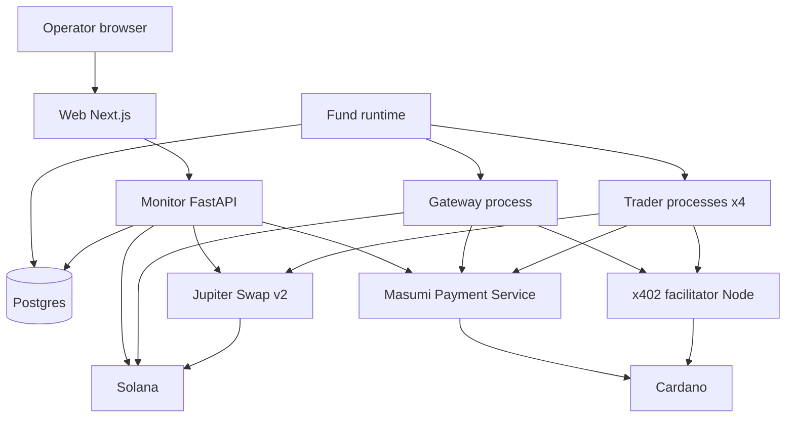
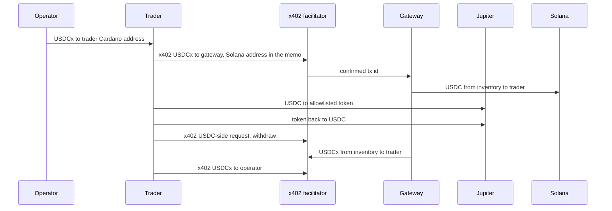

# Architecture

The whole system, not only the agents. Decisions and the evidence for them are in [DECISIONS.md](DECISIONS.md). This document is the build spec. Nothing here is implemented yet.

One operator runs one fund. Four trader agents each hold one market (gold, stocks, ETH, BTC). A gateway agent the operator also runs is the inventory between Cardano and Solana. Agent-to-agent budget moves are Cardano x402 payments on Masumi's rails. Service fees and reports are Masumi escrow jobs. Swaps happen on Solana through Jupiter. A web app shows value, fees, and an audit trail, and accepts policy changes that take effect on the next round. The one-minute pitch plays a paper replay of two to three months. The same pages then read the live fund. Section 15.

## 1. What is in and out

In:

- Mode 1: one trader, one market, fund and cash out.
- Mode 2: four traders, a formula that moves budget toward whoever is earning, and a chart of that.
- Long-only spot. Buy the allowlisted token with USDC, sell it back to USDC.
- A hash-chained event log whose head is written into a Masumi job result.
- Hard limits in code, a kill switch, and fees broken out so a short demo does not pretend to be an edge.
- A one-minute replay: BTC, ETH, and the S&P 500, paper trades only, then a switch onto the live fund.

Out:

- Shorts, options, futures, perps. The HedgeAgents paper hedges with those. We do not have the venues.
- A second user, accounts, or a marketplace listing (Sokosumi).
- Hydra. Masumi can run a 2-party head. We will not host one for the hackathon.
- A live bridge inside a trade. Inventory is funded before the demo.
- Importing `ai-hedge-fund`. We copy the shape of its ledger and its clamp events.
- Replay rows in the Masumi audit, or a replay profit copied in as a live deposit.
- An agent meeting that sets weights. A headline does not set the score and does not negotiate a strategy.

The paper's useful slice is the shape: specialists, a manager who is not one of them, a periodic budget conference, and an emergency de-risk. The experience-sharing conference and the options hedge are not in this build.

## 2. Processes



| Process | Language | Holds keys | Talks to |
|---|---|---|---|
| Masumi Payment Service | Node, upstream | Cardano hot-wallet mnemonics, encrypted with `ENCRYPTION_KEY` | Cardano via Blockfrost, Postgres (its own schema) |
| x402 facilitator | Node, ours | The same Cardano mnemonics, read from the same env file | Cardano via Blockfrost, called by Python over HTTP |
| Trader, one per market | Python 3.11 | That market's Solana key only | Facilitator, Payment Service, Jupiter, fund runtime |
| Gateway | Python 3.11 | Gateway Solana key (USDC inventory) | Facilitator, Payment Service, Solana RPC |
| Fund runtime | Python 3.11 | None | Postgres, trader HTTP, gateway HTTP |
| Monitor | Python 3.11, FastAPI | Operator token, Payment Service read key. No chain keys | Postgres, Payment Service, Solana RPC, Jupiter Price v3 |
| Web | Next.js | Nothing | Monitor only |

The fund runtime is the only scheduler. Traders do not wake themselves on a cron that can race an allocation round. A tick asks one trader to consider a swap, or runs one allocation round. The trader still refuses locally if the kill switch is set or a limit fails. Defense is in both processes so a bug in the runtime cannot skip the allowlist.

Agents call each other on the Docker network. The Masumi registry stores an `apiBaseUrl`. Registration does not check that the URL answers. Buyers and the registry indexer do. Internal agent-to-agent jobs can use the Docker DNS name. A tunnel (cloudflared or ngrok) is only required if someone outside the machine must open the agent from the registry during the demo.

Sokosumi is not on the path.

### Repo

```
agents/
  common/          limits, policy client, jupiter, masumi rest, ledger client, signals
  trader/          MIP-003 server plus the swap handler the runtime calls
  gateway/         MIP-003 server plus deposit and withdraw handlers
  facilitator/     Node, @x402/cardano
monitor/           FastAPI, sampler, chat, policy, kill switch
web/               Next.js
infra/             docker-compose, env example
docs/
```

`infra/docker-compose.yml` is ours. Upstream `masumi-payment-service` has a Dockerfile and no compose file. Compose runs Postgres (one instance, two databases: `masumi` and `hedge`), the payment service, the facilitator, the monitor, the runtime, and the agent processes. The web can run in compose or on the host.

### Environments

Two names, never mixed in one process: `preprod` and `mainnet`.

| | Preprod | Mainnet |
|---|---|---|
| Cardano | Preprod, Blockfrost preprod project | Mainnet, Blockfrost mainnet project |
| Stablecoin | tUSDM | USDCx |
| Unit | `16a55b2a349361ff88c03788f93e1e966e5d689605d044fef722ddde0014df10745553444d` | `1f3aec8bfe7ea4fe14c5f121e2a92e301afe414147860d557cac7e34` + `5553444378` |
| Solana | Devnet | Mainnet |
| What "done" means | Registry, one escrow cycle, one x402 send | Wallet balances match the audit |

A process exits on startup if `CARDANO_NETWORK` and `SOLANA_CLUSTER` are not the pair in that table. Preprod tUSDM and mainnet USDC are not the same money. The Preprod UI says so on every page.

Payment Service poll settings we set explicitly, because `.env.example` is several times slower than the code defaults:

- `CHECK_TX_INTERVAL=20`
- `BATCH_PAYMENT_INTERVAL=30`
- `BLOCK_CONFIRMATIONS_THRESHOLD=1`

Contract is V2 only. Every list call passes `filterPaymentSourceType=Web3CardanoV2` or the V2 script address. V2 Preprod address `addr_test1wzs4e6wc95hkwezlccjw9mdvq0r0rsgx6zk34avptga3ftgn37w4g`. V2 Mainnet address `addr1wxs4e6wc95hkwezlccjw9mdvq0r0rsgx6zk34avptga3ftgge2j6d`. Registry policy V2 `67ab0c92c4ac1610895a1c965ee50aba41a8f1513b15240723b3bd0b` on both networks.

## 3. Wallets and keys

Five Cardano identities (four traders and the gateway) and five Solana keypairs (the same four, plus the gateway's USDC inventory).

Cardano keys are 24-word mnemonics in the local env file, listed once per wallet. The Payment Service imports them as hot wallets (`Selling` and `Purchasing` roles on one `PaymentSource` per network). The facilitator reads the same mnemonics to sign x402 transactions. There is one copy of the secret, two consumers, both local. The Payment Service encrypts its copy with `ENCRYPTION_KEY`. Losing that key makes the node's copy unreadable, so the env file is the backup and it is written down before the first restart. The admin API key never goes into an agent, a prompt, or the browser.

Solana keys are separate env entries, one per process. The monitor and the fund runtime do not have them. Logs print public keys and tx ids only.

Each Cardano hot wallet needs:

- At least 5 ADA parked as the collateral UTxO (`COLLATERAL_RESERVE_LOVELACE`).
- About 10–20 ADA of fee float on top of that.
- The stablecoin inventory that role is supposed to hold.
- Several UTxOs rather than one. A wallet locks while a transaction is in flight (`lockedAt` on the hot wallet, stale after 300 seconds). Building a second transaction from a stale UTxO fails with `BadInputsUTxO`. Before the demo, split each wallet into several outputs (for example ten outputs of 2 ADA plus a slice of stablecoin) so a later send has a free input. The runtime still sends from one wallet one transaction at a time.

`POST /wallet/transfer-funds` is the admin plain-send. Minimum 2 ADA of lovelace, plus up to ten native assets. It is queued and asynchronous. It is the D3 fallback, not the normal path.

Agent registration is `POST /api/v1/registry` with `type: Standard`, the Docker or tunnel URL, tags, author, and `supportedPaymentSources` priced in the environment's stablecoin unit. Pricing amounts are 6-decimal raw integers. `identifierFromPurchaser` on every payment and purchase is 14–26 hex characters that we generate. The SDK default string is rejected.

## 4. Masumi jobs

Traders and the gateway are MIP-003 HTTP services. The Python SDK serves `/start_job`, `/status`, `/availability`, and `/input_schema`. Creating the payment with a short deadline is our REST client, not `Payment.create_payment_request`, because the SDK sends deadlines of 12 hours and 24 hours.

Deadlines we send, the API minimums:

- `payByTime` a few minutes ahead.
- `submitResultTime` at least 15 minutes from now.
- `unlockTime` at least 15 minutes after `submitResultTime`.
- `externalDisputeUnlockTime` at least 15 minutes after `unlockTime`.

The seller can withdraw the fee about 45 minutes after the request, plus a confirmation and the collection cron. Callers treat `FundsLocked` as "the fee is committed, start the work". They do not treat it as spendable cash.

Jobs:

| Job | Seller | Price | Input | Result |
|---|---|---|---|---|
| `deposit_to_solana` | Gateway | Flat fee | Amount, x402 tx id, Solana address | Solana USDC signature |
| `withdraw_to_cardano` | Gateway | Flat fee | Amount, Solana tx signature, Cardano address | Cardano tx id |
| `report` | Trader | Flat fee, can be zero if we register a free tier; otherwise the smallest unit we will bother to lock | Window | JSON: value, return, volatility, drawdown, position, reasoning, and the audit head hash when this report is an anchor |

There is no `accept_budget` job. The x402 tx id is the receipt.

`/availability` on the gateway checks inventory against the low-water mark and the remaining daily cap. If it cannot fill the largest job it is willing to quote, it returns `unavailable` so a buyer does not lock a fee we would have to refund.

Hashes follow MIP-004 as the SDK implements it. `input_hash` is `sha256` of `identifier_from_purchaser`, a semicolon, and RFC 8785 canonical JSON of the input. `output_hash` is `sha256` of the identifier, a semicolon, and the escaped output string. The seller posts that hash with `POST /payment/submit-result`. The result body itself is on `GET /status` for the buyer to recompute.

State we act on, from the payment service enum: `FundsLocked` starts the work, `ResultSubmitted` means we have posted the hash, `Withdrawn` means the seller collected. `RefundRequested` and `Disputed` are the failure path for the fee. Buyer calls `POST /purchase/request-refund` before `unlockTime`. Seller calls `POST /payment/authorize-refund` when it will not deliver. We do not call `AuthorizeWithdrawal` from a disputed state as a shortcut to get capital out. Capital was never in the datum.

## 5. Money



### Mode 1

1. The app shows the trader's Cardano address and a QR-less copy field. The operator sends USDCx (or tUSDM) from any wallet. A CIP-30 browser wallet is optional and not on the critical path. The monitor sees the inbound transfer by reading the address through Blockfrost, or through the payment service's wallet endpoints if the address is a hot wallet. It records a deposit in `transfers` and a buy-and-hold lot (section 8).
2. The runtime asks the trader to move cash to Solana. The trader calls the facilitator: pay the gateway's Cardano address, asset unit of this environment, amount in raw units, and attach the trader's Solana address. The facilitator signs `exact` / `default` (wallet to wallet, not escrow), submits, and returns the tx id after one block. The trader then opens `deposit_to_solana` with that tx id, the amount, and the Solana address, and pays the flat fee into escrow.
3. The gateway's handler loads the Cardano tx, checks the amount and the asset, checks its USDC inventory and the caps, and sends USDC. The send creates the trader's associated token account if needed. It uses the SPL Token program for USDC. It returns the signature as the job result and submits the result hash. Fee collection happens later, when `unlockTime` passes. The payment service does that on its collection cron. We do not block the swap on it.
4. The trader swaps USDC to the allowlisted mint, inside the limits in section 7.
5. Cash out is the reverse. Swap to USDC. Send USDC to the gateway. Open `withdraw_to_cardano`. Gateway confirms the Solana signature, then x402-sends USDCx to the trader. Trader x402-sends USDCx to the operator address stored on the fund.

If the gateway has not sent by its own deadline (a few minutes, not the escrow unlock), it x402-returns the capital to the sender and authorizes a refund of the fee. The capital refund is application-level because direct x402 has no script that can claw it back. The fee refund is the MIP-003 path.

The gateway never extends credit. No USDC leaves until the inbound x402 tx has one confirmation. No USDCx leaves until the Solana USDC transfer is confirmed.

### Mode 2

The operator deposits to one Cardano address. That address belongs to one trader only in the sense that the cash lands there. The runtime's first allocation splits it. That trader does not get to edit the weights.

Each agent targets a Cardano stablecoin buffer of 15% of its share. A rebalance smaller than the buffer moves by x402 on Cardano and never touches the gateway or Jupiter. A larger move is serialized:

1. Sender sells a slice to USDC.
2. Sender withdraws that USDC through the gateway.
3. Sender x402-pays the receiver on Cardano.
4. Receiver deposits through the gateway and buys its token.

One wallet, one in-flight Cardano transaction. The round waits for each send to confirm or fail before the next send from the same wallet. Different agents can move at the same time.

The round row stores weights before, weights after, every tx id, the score inputs, and the objections with whether code applied them.

### What a transfer costs

Replaces the old "1.8 ADA and 5%" table.

| Item | What it actually is |
|---|---|
| x402 send | About 0.17 ADA in fees. About 1.17 ADA of min-UTxO travels with the token and returns when the recipient spends that output. |
| Hot wallet | 5 ADA collateral, parked. 10–20 ADA fee float. |
| Escrow job | Three script transactions on the flat fee only. Seller withdraws about 45 minutes after the request. V2 fee rate is 0 today. We still keep capital out of the price so a future 5% cannot skim it. |
| Jupiter, demo size | About 0.1% to 0.3% all-in on the mints in DECISIONS.md, read from the quote's `inUsdValue` and `outUsdValue`. Part of that is Jupiter's platform fee on `/order`. |
| Solana base fee | Negligible next to the spread. Priority fee is Jupiter's on the `/execute` path. |

Below about $100 per agent, one round trip through the gateway dominates the result. Demo budgets are $100–250 per agent on mainnet. PAXG's book is about $343k, so we do not size a gold clip like a BTC clip. A $10k PAXG swap was already about 0.29% on the check day. Demo clips stay in the hundreds.

### Inventory

The gateway is pre-funded on both chains before anyone deposits. Mainnet: USDCx bought through the xReserve portal (USDC in, about 15–25 minutes) and USDC already on Solana. Getting USDCx back to USDC is about two hours. We do not start that hop during a demo. Preprod: tUSDM from the Masumi dispenser on one side, devnet USDC on the other, and the UI says the peg is fake.

Low-water marks are configuration. Under the mark, `/availability` is `unavailable` and the profile page shows the inventory number. Topping up is a person sending tokens, then a button in the monitor that re-reads balances. There is no automatic xReserve call.

## 6. Trading

A tick, for one agent, in order:

1. Read the kill switch and the current policy. Stop if trading is halted or this agent is paused.
2. Read the last prices from `prices` and the agent's balances from chain (the monitor's sampler is the usual source; the trader re-reads Solana itself before signing).
3. Build a view. The LLM sees the candle summary, the position, the policy, and an optional headline. It returns `conviction` in `[-1, 1]` and a short `reasoning`. Any parse failure, timeout, or exception becomes a hold: conviction 0, `abstained: true`. A failure never becomes a trade. The candle summary for the mark is `prices`. Binance BTC and ETH klines, an S&P series, and a headline feed may sit beside that view. They are specified in section 15. They are not the mark and they are not a fill.
4. Map conviction to a target fraction of the agent's value in the token: `clamp(base + k * conviction, 0, max_token_pct)`. Policy can lower `max_token_pct` and `k`. It cannot raise them above the code caps.
5. Diff target against the current token value. If the difference is under the minimum trade size, do nothing.
6. Run the limits in section 9. Any failure logs a clamp or a reject and does not sign.
7. `GET /swap/v2/order` with `inputMint`, `outputMint`, `amount` in base units, `taker`, and an explicit `slippageBps`. Omitting slippage lets Jupiter's RTSE pick it. We do not omit it. A free API key goes in `x-api-key`.
8. Sign with `solders`: decode the versioned transaction, sign the versioned message bytes, write that signature into the taker slot, leave every other signature in place.
9. `POST /swap/v2/execute` with the signed bytes and the `requestId`. On −1000, −2000, or −2003, request a new order. Do not resubmit the same bytes and do not reuse the `requestId`.
10. Write the decision, the quote's in and out USD, the signature, and the mint. The sampler later joins the confirmed balances.

Price history for the signal is our own `prices` table, filled by the monitor from Jupiter Price v3. We do not call a fundamentals API. Gold, stocks, ETH, and BTC share this loop. The stock trader is not a Buffett persona. Those personas in `ai-hedge-fund` v2 need SEC filings and do not run on a price series.

Default cadence is a few minutes per agent, one agent per tick, so Jupiter's 1 rps free tier is not the bottleneck. A quote plus an execute is two calls and happens only when a limit-cleared order exists.

Token accounts: USDC is Tokenkeg. PAXG and xStocks are Token-2022. The associated-token-account instruction has to name the mint's token program. A Tokenkeg ATA for SPYx or PAXG is the wrong account. `/order` with a `taker` creates the destination account when the route can. A plain USDC send from the gateway uses `createAssociatedTokenAccountIdempotent` with the USDC program id, then `transfer_checked` at 6 decimals.

Scaled UI: xStock value is `raw_amount * multiplier / 10^decimals * usdPrice`. The multiplier comes from the mint's scaled-UI extension, cached when the sampler first sees the mint, and refreshed daily. SPYx was about 1.0039 on 8 Oct 2026. Forgetting it makes PnL disagree with the wallet.

## 7. Allocation

The runtime runs this, not a trader. Demo cadence is 30 minutes. It does not run until `value_snapshots` has a minimum history (configurable, default one hour) so the opening noise does not move money.

Score for agent `i`, over the trailing window (default one day, shorter in a demo if we have to):

```
decayed_return_i = sum_t (w_t * return_i,t) / sum_t w_t
score_i = max(decayed_return_i, 0) / max(vol_i, vol_floor)
```

`w_t` decays so a winning hour fades. `vol_floor` stops a flat agent from taking the whole fund on a tiny denominator. If every score is below a floor, the round records "no change" and does not send.

Otherwise target weights are proportional to score, then projected onto:

- `0.10 <= weight_i <= 0.50`
- sum is 1
- if `abs(target - current) < 0.05`, that agent stays
- `abs(target - current) <= max_step`, with `max_step = 0.20` in the demo and `0.10` when the cadence is daily
- an agent that was a sender last round cannot be a sender this round

Projection is clip, then renormalize, then clip again. If a second clip breaks the sum, the leftover stays in the current weights rather than being forced through a cap. The round logs each clip the way `ai-hedge-fund` logs a `ClampEvent`: limit name, before, after.

Objections are collected over HTTP from each trader before the projection is final. The trader's LLM may return a code:

- `rule_breach` plus one of `cap`, `cooldown`, `kill_switch`, `daily_stop`
- `comment` plus free text

`rule_breach` is applied only if the runtime recomputes the same breach. `comment` is stored and does not change weights. An objection has no field for a proposed weight. That is deliberate.

Daily-loss stop: if an agent's value is down more than `daily_loss_pct` versus the snapshot at the UTC day boundary, the runtime sets that agent's target token fraction to the policy minimum (cash), excludes it from receiving budget, and the trader's own check will refuse new buys. This is the extreme-market conference we can actually run. It does not buy puts. A headline the code maps to the emergency tag enters this same path. The tag names the agent and the rule. It does not name a weight. The one-minute pitch replays this path from a handwritten score drop. Section 15.

The user's policy (section 10) can set a tighter cap per agent, pause an agent (weight frozen, no buys), or lower `k` and `max_token_pct`. It cannot set a cap above 50% or a floor under 10%, and it cannot disable the daily-loss stop.

## 8. Benchmarks

Mode 1, buy and hold. When a deposit confirms, record `units = deposit_usd / price` of that agent's token, and the tx id. Forever after, the benchmark is `units * current_price` using the same scaled-UI price as the agent. Fees the agent paid are not subtracted from the benchmark. The gap between net value and this line is the thing the profile shows.

Mode 2, no reallocation. At the first split, record `w0_i` and value `V0`. The dashed line at time t is `V0 * sum_i (w0_i * (V_i,t / V_i,0))` where `V_i` is the agent's value marked as if it had only traded and never sent or received budget. Practically: each agent also stores a shadow share count that updates on its own swaps and not on transfers. The dashed line is the sum of shadow values. It is an approximation only in that shadow shares use the same fills the agent actually got, not a simulated fill at the starting weight. The chart says that in the tooltip. It does not invent a second price series.

Both lines sit next to net value after fees. A few hours of return are mostly noise. The copy on the profile says the chart is the mechanism, not proof of an edge.

## 9. Safety limits

All of these are constants or policy fields checked in Python before a signature. None of them are prompt text.

| Limit | Default | Where |
|---|---|---|
| Allowlist | USDC plus the one mint for that agent | Trader, on every order |
| Max trade | 25% of agent value and an absolute USD cap (default $100) | Trader |
| Slippage | `slippageBps` default 50, hard max 100 | Trader, sent on `/order` |
| One in-flight swap | Per agent | Trader |
| Daily loss stop | 5% from the UTC day-open snapshot | Runtime and trader |
| Weight floor / cap | 10% / 50% | Runtime |
| Min move / max step | 5 points / 20 demo, 10 slow | Runtime |
| Gateway per job | Default $200 | Gateway |
| Gateway per day | Default $1,000 | Gateway |
| Kill switch | Row in `controls` | Every signer, every tick |

The kill switch stops new swaps and new allocation sends. It does not auto-sell and it does not auto-withdraw. The operator does that by hand, or leaves the positions and only stops the churn. Unsetting it is a separate authenticated call.

Mainnet trading stays off until both of these have happened: one Preprod escrow job has gone `FundsLocked` → result submitted → withdrawable, and one mainnet round trip of a few dollars (x402 to gateway, USDC back, one swap, swap back, USDCx home) matches the audit to the wallets within dust.

## 10. Monitor and data

Postgres is the record of decisions. Cardano and Solana are the record of money. The sampler's job is to show when those disagree.

### Tables

`agents` — id, market, display name, masumi agent identifier, cardano address, solana address, environment.

`wallets` — agent id, chain, address, role (`budget`, `trading`, `gateway_inventory`).

`policies` — version integer, hash, body JSON, created at, confirmed by. The body holds per-agent caps, paused flags, `k`, `max_token_pct`, and the risk label the chat uses. Agents fetch the max version.

`decisions` — agent, tick time, conviction, reasoning, abstained, target fraction, action (`hold`, `buy`, `sell`), clamp or reject reason, quote in USD, quote out USD, solana signature, status.

`masumi_jobs` — job name, buyer, seller, blockchain identifier, price amount and unit, state, input hash, result hash, cardano tx ids, linked x402 tx id.

`transfers` — from, to, chain, asset, amount raw, amount usd, tx id, kind (`deposit`, `x402`, `plain_transfer`, `gateway_usdc`, `cashout`, `refund`), related job id.

`trades` — agent, mint in, mint out, amounts, signature, in USD, out USD, slot.

`allocation_rounds` — started at, weights before, weights after, scores, objections JSON, transfer ids, reason.

`prices` — mint, usd price, scaled multiplier, source, block id, sampled at.

`value_snapshots` — agent, sampled at, stablecoin cardano usd, usdc solana, token usd, fee float ada, fee float sol, total trading usd. Trading total excludes the fee float.

`buy_hold_lots` and `shadow_shares` — the two benchmarks in section 8.

`chat_messages` — role, text, policy version proposed, policy version confirmed.

`controls` — single row, kill switch boolean, set at, set by.

`events` — append only. Columns: id, time, kind, payload JSON, prev_hash, hash. `hash` is `sha256` of the canonical JSON of the row excluding `hash`. `prev_hash` is the previous row's hash, or 64 zeros for the first. The insert runs in a transaction that locks the tail. If `prev_hash` does not match the current tail, the insert fails. Updates and deletes are revoked from the application role.

`replay_frames`, `replay_trades`, `replay_headlines` — the paper tape in section 15. Same numbers the profile shows (weights, value, profit, fees) and one row per paper trade. Simulated timestamps only. No chain tx id. These tables are not inserted into `events`.

The runtime anchors by asking a trader to sell a `report` whose output string contains `audit_head` equal to the current `events` hash. The on-chain `result_hash` is then a commitment to that string. The audit page stores the job id next to the head it covered. A judge recomputes the hash from `/status` and checks it against the datum, or against the payment-service record of the submitted hash.

### Sampler

Once a minute, and on demand after a trade:

- Jupiter Price v3 for USDC, the four mints, and a SOL and ADA price for the fee line.
- Solana balances via RPC (`getTokenAccountsByOwner` for both token programs).
- Cardano stablecoin and ADA via Blockfrost, or the payment service wallet balance if the address is hosted there.
- Payment and purchase states from the payment service, V2 filter only.

It writes `prices`, `value_snapshots`, and fills in `transfers` and `trades` it had not seen. A snapshot that disagrees with the last decision's expected balance by more than dust raises an `events` row of kind `reconcile_mismatch`. The profile shows that banner. We do not silently overwrite the decision.

### Profit

For the fund and per agent:

- Gross is the change in trading value, before the fee lines, after deposits are subtracted.
- Fees are the sum of: Cardano fees in ADA times ADA/USD, Solana fees in SOL times SOL/USD, gateway flat fees actually charged, and the swap gap `inUsdValue - outUsdValue` on each confirmed quote.
- Net is gross minus those fees.
- Min-UTxO that moved between our own wallets is not a fee. It is still inside the fund. Min-UTxO that we sent to the operator on cash-out is part of the cash-out, shown as float that left with the payment.

### HTTP the web uses

Reads, no token: `GET /fund`, `GET /agents`, `GET /snapshots`, `GET /events`, `GET /rounds`, `GET /inventory`, `GET /policy`. Replay reads, also no token, and not a union with the live routes: `GET /replay/frames`, `GET /replay/trades`, `GET /replay/headlines`.

Writes, operator token: `POST /kill-switch`, `POST /policy/confirm`, `POST /chat`. Chat either returns an answer grounded in the rows above or a policy diff. Confirm is a second call. The first call does not store a policy.

The operator token is a shared secret in the env, sent as a header. There is no user table.

## 11. Web

Next.js, one app, polling the monitor every few seconds. No wallet connection on the critical path.

| Page | What it shows |
|---|---|
| Profile | Trading value, deposits, gross, net, fees by type, buy-and-hold gap. Preprod banner if the environment is preprod. Reconcile banner if the sampler is unhappy. |
| Audit | `events` in time order. Each row: kind, amounts, reason, hash, previous hash, links. Cardano: `https://cardanoscan.io/transaction/{tx}` and `https://preprod.cardanoscan.io/transaction/{tx}`. Solana: `https://solscan.io/tx/{sig}` and the devnet query when needed. Masumi payment records when we have an explorer URL for that identifier. |
| Team | One line per agent and a total, from `value_snapshots`. Markers on `allocation_rounds`. Clicking a marker opens the weights, the objections, and the tx links. The dashed line is section 8, and it is allowed to ship after the solid lines. |
| Chat | Questions hit `POST /chat` and render the answer with the row ids it used. Instructions render a before/after policy. Confirm posts `POST /policy/confirm`. The page states that the next round applies it, and that this page cannot move money by itself. |
| Controls | Kill switch, gateway inventory, last anchor head. |

Empty states are real screens: no deposit yet, no round yet, sampler stale. A stale sampler (no snapshot for several minutes) is a banner, not a frozen last number presented as live.

The pitch and the live fund are the same pages. Replay shows a recording banner and hides explorer links. The operator switches once. The pages then call the live routes. The switch does not copy replay totals into the live book. If the live fund has no deposit yet, the profile shows that empty state.

## 12. Failure modes

| What breaks | What the system does |
|---|---|
| LLM timeout or bad JSON | Hold. Decision row says `abstained`. |
| Jupiter 429 or execute −1000 / −2000 / −2003 | No retry of the same bytes. New order next tick if the target still wants it. |
| JupiterZ signature slot overwritten | Avoided by keeping existing signatures. Test covers this. |
| x402 returns `settlement_pending` | Facilitator polls until one confirmation or the 75 second timeout, then returns an error. No USDC is sent. |
| Gateway inventory short | `/availability` is `unavailable`. In-flight job that passed availability and then lost inventory authorizes a fee refund and returns the x402 capital. |
| Second Cardano send from a busy wallet | Runtime serializes. A `BadInputsUTxO` from the fallback transfer endpoint is an event, not a retry storm. |
| Payment service on the slow example intervals | We do not use those intervals. If someone copies `.env.example` anyway, the audit will show long `FundsLocked` waits. The runbook says to diff the three interval vars on startup. |
| Kill switch | Signers no-op. Positions stay. Cash-out is manual. |
| Database rewrite | Application role cannot update or delete `events`. The Masumi anchor is the external check. A mismatch between the recomputed chain and the anchored head is a banner. |
| `ENCRYPTION_KEY` lost | Payment service cannot spend. Env mnemonics still can, via the facilitator or a manual wallet. The runbook says to confirm the env file has the phrases before the first restart. |
| Issuer freeze on PAXG, an xStock, cbBTC, or USDC | The swap fails or the account cannot send. The decision row records the RPC error. We cannot code around a freeze. WETH has no freeze authority; that does not make it the default for the other markets. |
| Operator is a US person and the stock is an xStock | Not a runtime check. The decision log says the operator has to be allowed to hold xStocks. The default demo stock is SPYx only when that is true. |

## 13. Phases

Cut order if time runs out: chat, then the dashed benchmark line, then the ETH and BTC agents. Gold, one xStock, the gateway, the profile, and the audit are the live demo.

The one-minute stage pitch is section 15. It can be built once the allocator runs offline on downloaded bars. It does not wait for a mainnet round trip. PLAN.md section 10 stays the live walkthrough, for when the room asks to see a real transaction.

### Phase 0 — wiring

Compose Postgres, the payment service, and the facilitator. Register the gateway and one trader on Preprod V2. Fast poll intervals. One escrow job with our short deadlines, and one tUSDM x402 send that returns a confirmed tx id.

Done when the escrow job has been `FundsLocked`, had a result submitted, and is withdrawable, and the x402 tx is on Preprod Cardanoscan. Not done when a devnet balance matches tUSDM. It will not.

### Phase 1 — mode 1

Gateway deposit and withdraw, with the inventory check and both refund paths. One trader, SPYx or PAXG, with the loop, the limits, and `report`. Monitor sampler, profile, audit. Preprod proves the messages. Mainnet with a small budget proves that net value in the audit matches the wallets within dust.

Done when the operator can fund, cross to Solana, buy, sell, and cash out, and every step is an audit row with an explorer link.

### Phase 2 — mode 2

Four processes from one trader codebase, four registry entries, four Solana keys. First split from the deposit address. Allocation as in section 7, buffer first, gateway only when the buffer is not enough. Team chart with round markers.

Done when three live rounds show one agent gain share and later give it back, each round with a reason and tx links. The step size and the one-round sender cooldown exist so this sentence can be true.

### Phase 3 — policy

Chat that either answers from SQL or proposes a policy. Confirm stores a version. The next round obeys it. Dashed no-reallocation line.

Done when "cap stocks at 20%" is visible in the following round's weights.

### Phase 4 — demo hardening

Kill switch drilled once on mainnet with a tiny book. Gateway inventory topped up above the low-water mark by more than the script needs. A recorded walkthrough, because a chain stall during the demo is a plausible outcome and the recording is the backup.

## 14. Build notes that are easy to get wrong

- Python talks to the payment service REST for deadlines. The SDK is the HTTP server shell.
- `paymentType: Web3CardanoV1` is not sent. V2 is selected by the agent identifier and the contract address.
- Amounts on Cardano are integers of 10^6. A "25 dollars" literal that is actually 25 raw units is 0.000025 dollars.
- Jupiter `amount` is base units. USDC has 6 decimals. WETH and cbBTC have 8. xStocks and PAXG have 8 and 6 respectively; read the mint, do not hard-code past the allowlist table.
- `priceImpact` on Swap v2 is not a fraction in the way the older docs show. Trust `inUsdValue` and `outUsdValue` for the fee line.
- Do not send swaps through the public Solana RPC. Helius free tier (about 1M credits per month, 10 requests per second) is enough for four agents if Jupiter `/execute` lands the swap and our RPC is only balances and ATA checks.
- Blockfrost free tier is 50,000 requests per day and 10 per second. Preprod and mainnet are separate projects. The payment service and the monitor should share a paid key if both poll at 20 seconds across five wallets.
- Pin `pycardano` only if some tool outside the payment service has to build a transaction. The normal send path is the facilitator or `transfer-funds`. If PyCardano is installed, pin `cbor2<6` or the import breaks on current `cbor2`.

## 15. One-minute replay, then live

The pitch is one minute. A live allocation round is thirty minutes, and a fee escrow unlocks in about forty-five. Two or three months of weights, profit, and one shock cannot be shown by waiting on mainnet. The pitch plays stored frames. Prices come from the bars. The score is the handwritten series. The weight rules and the daily-loss path are the live ones. The product behind the same pages is the live fund in the rest of this document.

The live service can be up during the pitch. Switching is a change of which routes the pages call. It is not a redeploy, and it is not a migration.

| | Replay | Live |
|---|---|---|
| Clock | About 60 seconds, covering 2–3 months of bars | Wall clock |
| Sleeves on screen | BTC, ETH, S&P 500. Gold is not on the tape. | Gold, stocks, ETH, BTC |
| Prices | Binance public spot klines, `BTCUSDT` and `ETHUSDT`, 30-minute bars, no key. A free daily OHLC series for the S&P 500. Binance has no spot S&P. If the stock series is daily, that sleeve holds the last daily return between prints. | Jupiter Price v3 is the mark and the fill. The Binance klines, the S&P series, and a headline feed are slow inputs beside the view in section 6. |
| Money | Paper. The sim loads no chain key and does not call the facilitator, the payment service, or Jupiter `/execute`. | Sections 4–6 |
| History | Every paper trade the sim wrote. Profile value, weights, and profit at a frame recompute from that trade list and the bar at that timestamp. | `events`, `trades`, `transfers`, explorer links |
| Audit | Banner: this is a recording. No `events` row, no Masumi `report`. | Section 10 |

**Building the tape.** A sim entry point of the fund runtime. It downloads the bars for prices. The score is the handwritten series in PLAN.md section 12: about eight to twelve points per sleeve, stored on `replay_frames`, not computed from the bars. The sim steps the caps, the buffer, and the limits from sections 7 and 9 on that series, and writes `replay_frames`, `replay_trades`, and `replay_headlines`. The player reads those rows. It does not call an LLM and it does not recompute the score while the clock runs. The chart is the sum of the stored trades and the bar. Hand-drawn weights and profit are not a source. The score series is the one authored input.

Playback keeps those frames, including the one shock frame, and interpolates profile value between them so the minute moves. The history list is the sim's full trade set. The animation does not invent extra trades.

**The shock.** A drop of more than `0.20` from the previous point on one sleeve. The example is `0.87` to `0.40`. It starts one emergency round, the daily-loss path: the named agent is sold toward cash and blocked from receiving budget. A smaller step only moves budget. The weight of that sleeve can fall by at most `max_step` (20 points in the demo) in the same round. The slice that moves can be bought by another sleeve. The rest of the sale stays as cash in the sleeve that dropped. Each trader still returns an objection. Code applies it only when it recomputes the same rule. The frame shows the score before and after, the objections, and the weights before and after. No field on that frame is a proposed weight. The round does not end in a strategy the formula did not compute.

The score is not a dial from a safe asset to a volatile one. `0` does not mean gold and `1` does not mean BTC. Each sleeve has its own score. `0.87` and `0.40` are the same sleeve at two frames.

**Headline.** The live score reads prices only: decayed return divided by volatility. A headline that says the market crashed does not change the score when the prices did not move. On the pitch the headline is a caption on the shock frame. It does not fire the round. Live, an ordinary headline is context on the decision. The trader model may lower conviction, and the code may then hold a smaller token position inside the existing cap. A failed model call holds. The headline does not move budget between sleeves. Only a headline we have tagged as an emergency enters the daily-loss path, and that tag is not applied to an ordinary article.

**Live, after the switch.** Profile, chart, and history call the live routes. Live history starts at the first real deposit. Replay totals never become that deposit. Binance BTC and ETH klines, the S&P series, and a free headline feed keep updating in the background and can change conviction on a later tick. They cannot change the allowlist, the mark, or the venue. A headline mapped to the emergency tag trips the same daily-loss path as the tape. Any other headline is context on the decision row.

Leaving replay does not delete the tape. The pitch can be played again. Entering live does not restart the payment service.
