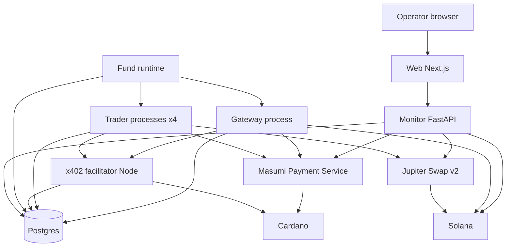
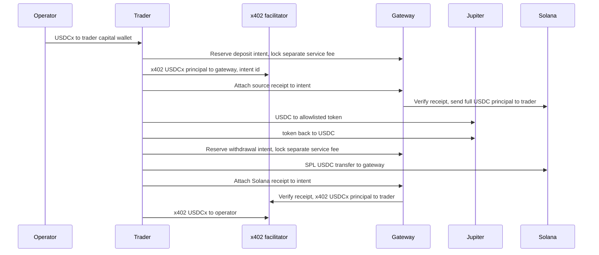

# Architecture

The whole system, not only the agents. Decisions and the evidence for them are in [DECISIONS.md](DECISIONS.md). This document is the build spec. Nothing here is implemented yet.

One operator runs one fund. Four trader agents each hold one market (gold, stocks, ETH, BTC). A gateway agent the operator also runs is the inventory between Cardano and Solana. Agent-to-agent budget moves are Cardano x402 payments on Masumi's rails. Service fees and reports are Masumi escrow jobs. Swaps happen on Solana through Jupiter. A web app shows value, fees, and an audit trail, and accepts policy changes that take effect on the next round. The one-minute pitch plays a paper replay of two to three months. The same pages then read the live fund. Section 15.

## 1. What is in and out

In:

- Mode 1: one trader, one market, fund and cash out.
- Mode 2: four traders, a formula that moves budget toward whoever is earning, and a chart of that.
- Long-only spot. Buy the allowlisted token with USDC, sell it back to USDC.
- A hash-chained event log whose head is written into a Masumi job result.
- Hard limits in code, a kill switch, and fees broken out so a short demo does not pretend to be an edge.
- A one-minute replay: BTC, ETH, and the S&P 500, paper trades only, then a switch onto the live fund.

Out:

- Shorts, options, futures, perps. The HedgeAgents paper hedges with those. We do not have the venues.
- A second user, accounts, or a marketplace listing (Sokosumi).
- Hydra. Masumi can run a 2-party head. We will not host one for the hackathon.
- A live bridge inside a trade. Inventory is funded before the demo.
- Importing `ai-hedge-fund`. We copy the shape of its ledger and its clamp events.
- Replay rows in the Masumi audit, or a replay profit copied in as a live deposit.
- An agent meeting that sets weights. A headline does not set the score and does not negotiate a strategy.

The paper's useful slice is the shape: specialists, a manager who is not one of them, a periodic budget conference, and an emergency de-risk. The experience-sharing conference and the options hedge are not in this build.

## 2. Processes



| Process | Language | Holds keys | Talks to |
|---|---|---|---|
| Masumi Payment Service | Node, upstream | Cardano purchasing and selling wallet mnemonics, encrypted with `ENCRYPTION_KEY`; no capital keys in normal operation | Cardano via Blockfrost, Postgres (`masumi` database) |
| x402 facilitator | Node, ours | Cardano capital-wallet mnemonics only | Cardano via Blockfrost, Postgres (`hedge`), called by Python over HTTP |
| Trader, one per market | Python 3.11 | That market's Solana key only | Facilitator, Payment Service, Jupiter, fund runtime, Postgres (`hedge`) |
| Gateway | Python 3.11 | Gateway Solana key (USDC inventory) | Facilitator, Payment Service, Solana RPC, Postgres (`hedge`) |
| Fund runtime | Python 3.11 | None | Postgres, trader HTTP, gateway HTTP |
| Monitor | Python 3.11, FastAPI | Operator token, Payment Service read key. No chain keys | Postgres, Payment Service, Solana RPC, Jupiter Price v3 |
| Web | Next.js | Nothing | Monitor only |

The fund runtime is the only scheduler of new trades and allocation rounds. Traders do not wake themselves on a competing trading cron. Signer recovery workers may reconcile existing intents, and the Payment Service runs its own escrow workers; neither invents a new trade. A tick asks one trader to consider a swap, or runs one allocation round. The trader still refuses locally if the kill switch is set or a limit fails. Defense is in both processes so a bug in the runtime cannot skip the allowlist.

Internal mutating HTTP calls carry a service credential scoped to the caller's agent and registered wallets. Docker DNS is not authentication. The facilitator never accepts an arbitrary wallet id or destination from an unauthenticated caller. The gateway's public MIP-003 shell does not bypass these checks. Signers use the common ledger client for durable intents and append-only events.

Agents call each other on the Docker network. The Masumi registry stores an `apiBaseUrl`. Registration does not check that the URL answers. Buyers and the registry indexer do. Internal agent-to-agent jobs can use the Docker DNS name. A tunnel (cloudflared or ngrok) is only required if someone outside the machine must open the agent from the registry during the demo.

Sokosumi is not on the path.

### Repo

```
agents/
  common/          limits, policy client, jupiter, masumi rest, ledger client, signals
  trader/          MIP-003 server plus the swap handler the runtime calls
  gateway/         MIP-003 server plus deposit and withdraw handlers
  facilitator/     Node, @x402/cardano
monitor/           FastAPI, sampler, chat, policy, kill switch
web/               Next.js
infra/             docker-compose, env example
docs/
```

`infra/docker-compose.yml` is ours. Upstream `masumi-payment-service` has a Dockerfile and no compose file. Compose runs Postgres (one instance, two databases: `masumi` and `hedge`), the payment service, the facilitator, the monitor, the runtime, and the agent processes. The web can run in compose or on the host.

### Environments

Two names, never mixed in one process: `preprod` and `mainnet`.

| | Preprod | Mainnet |
|---|---|---|
| Cardano | Preprod, Blockfrost preprod project | Mainnet, Blockfrost mainnet project |
| Stablecoin | tUSDM | USDCx |
| Unit | `16a55b2a349361ff88c03788f93e1e966e5d689605d044fef722ddde0014df10745553444d` | `1f3aec8bfe7ea4fe14c5f121e2a92e301afe414147860d557cac7e34` + `5553444378` |
| Solana | Devnet | Mainnet |
| What "done" means | Registry, one escrow cycle, one x402 send | Wallet balances match the audit |

A process exits on startup if `CARDANO_NETWORK` and `SOLANA_CLUSTER` are not the pair in that table. Preprod tUSDM and mainnet USDC are not the same money. The Preprod UI says so on every page.

Payment Service poll settings we set explicitly, because `.env.example` is several times slower than the code defaults:

- `CHECK_TX_INTERVAL=20`
- `BATCH_PAYMENT_INTERVAL=30`
- `BLOCK_CONFIRMATIONS_THRESHOLD=1`

Contract is V2 only. Every list call passes `filterPaymentSourceType=Web3CardanoV2` or the V2 script address. V2 Preprod address `addr_test1wzs4e6wc95hkwezlccjw9mdvq0r0rsgx6zk34avptga3ftgn37w4g`. V2 Mainnet address `addr1wxs4e6wc95hkwezlccjw9mdvq0r0rsgx6zk34avptga3ftgge2j6d`. Registry policy V2 `67ab0c92c4ac1610895a1c965ee50aba41a8f1513b15240723b3bd0b` on both networks.

## 3. Wallets and keys

Five agent identities (four traders and the gateway). Each has three distinct Cardano wallets and one Solana keypair: fifteen Cardano wallets and five Solana keypairs in the full configuration.

| Cardano role | Sole active signer | Purpose |
|---|---|---|
| `capital` | Facilitator | Trader budget or gateway inventory; direct x402 capital sends |
| `purchasing` | Payment Service, `Purchasing` role | Pre-funded service-fee reserve; escrow locks and buyer refunds |
| `selling` | Payment Service, `Selling` role | Registry identity, result submission, fee collection; never trading capital |

Cardano keys are distinct 24-word mnemonics in a local, untracked env file. Compose injects only the appropriate entries into each service; it does not mount the whole file in a container. Capital keys are not imported into the Payment Service in normal operation. A key is not reused for purchasing and selling either: per-role database locks are not a cross-wallet mutex. Startup rejects overlapping active addresses or networks. The Payment Service encrypts its secrets with `ENCRYPTION_KEY`; back up the env securely before the first restart. The admin API key never goes into an agent, a prompt, or the browser.

Solana keys are separate env entries, one per process. The monitor and the fund runtime do not have them. Logs print public keys and tx ids only, never signed transaction bytes or secrets.

Each purchasing and selling wallet needs at least 5 ADA reserved for script collateral (`COLLATERAL_RESERVE_LOVELACE`) and about 10-20 ADA of fee float. Capital wallets need fee and min-UTxO float, but direct sends do not require script collateral. Purchasing wallets hold their own stablecoin fee reserve; capital wallets hold principal. Budget these reserves per wallet, not per agent. Fund-owned purchasing reserves count as contributed capital in section 10; seller revenue and gateway reserves do not.

For each capital or Solana wallet, its signer holds a database-backed exclusive wallet lock while preparing an attempt and permits only one unresolved transaction attempt. It stores signed bytes, the locally derived tx id/signature, validity bounds, and reserved inputs before broadcasting. A crashed worker losing its lock does not release the durable reservation. Recovery resolves the old attempt first. Payment Service wallets use its own queue and locks, now on disjoint inputs. Splitting UTxOs may improve availability; it is not the concurrency guarantee.

`POST /wallet/transfer-funds` is the admin plain-send, minimum 2 ADA plus up to ten native assets. The D3 fallback is a manual ownership handoff, not a second concurrent signer: halt new capital operations, stop the facilitator, resolve every outstanding attempt, then import capital wallets only as `Purchasing` wallets and enable Payment Service ownership. Use its queued transfer endpoint and reconcile each result. Switching back requires disabling those imported wallets, resolving the queue, and restoring facilitator ownership. If an old attempt is unresolved, the handoff is blocked. Rows are `plain_transfer`, never escrow.

Agent registration is `POST /api/v1/registry` with `type: Standard`, the Docker or tunnel URL, tags, author, and `supportedPaymentSources` priced in the environment's stablecoin unit. Pricing amounts are 6-decimal raw integers. `identifierFromPurchaser` on every payment and purchase is 14–26 hex characters that we generate. The SDK default string is rejected.

## 4. Masumi jobs

Traders and the gateway are MIP-003 HTTP services. The Python SDK serves `/start_job`, `/status`, `/availability`, and `/input_schema`. Creating the payment with a short deadline is our REST client, not `Payment.create_payment_request`, because the SDK sends deadlines of 12 hours and 24 hours.

Job identity, progress, and the exact result body live in Postgres, not only in an SDK in-memory store. After restart, `/status` returns the original persisted result. Retrying result submission does not execute the service again or regenerate its output string.

Payment creation for V2 must include `supportedPaymentSourceIndex`. Resolve it from the seller's advertised `supportedPaymentSources`, and verify the selected chain, network, V2 settlement address, and stablecoin unit against our allowlist. The agent identifier and contract address alone are not sufficient. Persist the selected index and returned `blockchainIdentifier`; the purchase reuses the returned terms without recomputing deadlines. Keep the purchaser nonce stable across retries. A lost creation response is reconciled by that nonce and the stored terms before another creation is attempted; an ambiguous match stops the intent.

Deadlines use one UTC request clock `t0` and include a one-minute validation buffer:

| Field | API constraint | Our default |
|---|---|---|
| `payByTime` | At least 5 minutes before `submitResultTime`; our request uses a future deadline | `t0 + 5 minutes` |
| `submitResultTime` | At least 15 minutes from the API's current time | `t0 + 16 minutes` |
| `unlockTime` | At least 15 minutes after `submitResultTime` | `t0 + 31 minutes` |
| `externalDisputeUnlockTime` | At least 15 minutes after `unlockTime` | `t0 + 46 minutes` |

Reject clock skew or an exhausted submission buffer before funding, rather than silently changing an existing job's terms. The uncontested seller unlock minimum is about 30 minutes from creation, not 45; our buffered default is 31 minutes, plus confirmation and collection scheduling. The roughly 45-minute minimum belongs to external dispute unlock. Callers treat `FundsLocked` as "the fee is committed, start the work", not spendable seller cash.

Jobs:

| Job | Seller | Price | Input | Result |
|---|---|---|---|---|
| `deposit_to_solana` | Gateway | Flat fee | Reserved `intent_id` and immutable terms: amount, source wallet, Solana destination, refund wallet | Intent id, source receipt, Solana USDC signature |
| `withdraw_to_cardano` | Gateway | Flat fee | Reserved `intent_id` and immutable terms: amount, source wallet, Cardano destination, refund wallet | Intent id, source receipt, Cardano tx id |
| `report` | Trader | Small positive flat fee for an on-chain anchor; a free report is not an anchor | Window | JSON: value, return, volatility, drawdown, position, reasoning, and the audit head hash when this report is an anchor |

There is no `accept_budget` job. The x402 tx id is the receipt.

`/availability` is advisory. The authoritative admission check is the atomic reservation in section 5, before a job or principal is funded. Gateway job input binds immutable intent terms; the later source receipt is attached to that intent, never by mutating the hashed job input. A repeated `/start_job` for the same intent returns the original job and does not charge another fee.

Hashes follow MIP-004 as the SDK implements it. `input_hash` is `sha256` of `identifier_from_purchaser`, a semicolon, and RFC 8785 canonical JSON of the input. `output_hash` is `sha256` of the identifier, a semicolon, and the escaped output string. The seller posts that hash with `POST /payment/submit-result`. The result body itself is on `GET /status` for the buyer to recompute.

State we act on, from the payment service enum: `FundsLocked` starts the work, `ResultSubmitted` means we have posted the hash, `Withdrawn` means the seller collected. `RefundRequested` and `Disputed` are the failure path for the fee. Buyer calls `POST /purchase/request-refund` before `unlockTime`. Seller calls `POST /payment/authorize-refund` when it will not deliver. We do not call `AuthorizeWithdrawal` from a disputed state as a shortcut to get capital out. Capital was never in the datum.

## 5. Money



### Mode 1

1. The app shows the trader's capital address and a QR-less copy field. The operator sends USDCx (or tUSDM) from any wallet. A CIP-30 browser wallet is optional. The monitor reads the capital address through Blockfrost and records a deduplicated external deposit and benchmark contribution. The trader's purchasing wallet must also have a separately recorded fee reserve before a job starts.
2. The trader calls the gateway's authenticated `POST /transfers/prepare` with a stable request id, direction, amount, and registered wallets. The gateway reserves destination inventory and daily capacity in Postgres and returns an `intent_id`, immutable terms, and deadlines. The trader opens `deposit_to_solana` for that intent and locks only the flat fee from its purchasing wallet. No principal is sent until the fee is `FundsLocked` and the reservation is still valid.
3. The facilitator records and broadcasts an x402 `exact` / `default` send from trader capital to gateway capital. Its memo may carry the intent id, but the memo is not proof. The trader attaches the persisted tx id and output index through `POST /transfers/{intent_id}/receipt`. The gateway verifies and exclusively claims the confirmed receipt as specified below, then sends the full principal amount in Solana USDC. The fee is not deducted a second time from principal. The SPL USDC send creates the recipient ATA idempotently if needed.
4. The confirmed payout becomes the job result and the seller submits its hash. Collection after `unlockTime` does not block the trader's allowlisted swap. Trading uses sections 6 and 9.
5. Cash-out reverses the chains, not the payment protocol. Reserve `withdraw_to_cardano` and lock its fee first, then send SPL USDC from trader to gateway on Solana and attach that receipt. The gateway x402-sends the full USDCx principal to trader capital only after verification. The trader settles any expense payable and x402-sends the remaining cash-out to the operator address stored on the fund. No x402 call sends Solana USDC.

Cardano-Solana transfers are deliberately non-atomic. A deadline is an escalation time, not proof that a transaction failed. If delivery cannot occur and no payout can still land, refund principal on its original chain: x402 USDCx/tUSDM to the registered Cardano source for a deposit, or SPL USDC to the registered Solana source for a withdrawal. Authorize the service-fee refund separately through MIP-003. A job with no confirmed inbound principal refunds only its fee; late principal is reconciled and returned, never silently dropped.

The gateway never extends credit. Cardano principal needs one confirmation; Solana principal needs successful `confirmed` status with `meta.err == null`. One Cardano confirmation is an accepted demo rollback risk, not irreversible finality. A later rollback freezes the affected intent and fund for reconciliation; it never launches an automatic replacement payment.

### Settlement and recovery contract

`POST /transfers/prepare` locks the inventory and daily-cap rows, checks per-job limits, and inserts the intent and reservation in one transaction. Free inventory is confirmed balance minus outstanding outgoing reservations, protected incoming principal, and the low-water mark. Every active reservation counts against the daily cap, including ones created before midnight: `settled_today_usd + active_reserved_usd + new_amount_usd <= daily_cap_usd`. Confirmation atomically moves reserved capacity to settled usage. Re-check the current UTC day's cap before a payout; never reset pending reservations at midnight. Refunded principal consumes no successful-exchange quota, but remains reserved until its refund confirms.

Requests are unique by `(environment, buyer_id, request_id)`; a retry with different terms returns `409`. The registered source, destination, refund wallet, asset, and amount cannot change after admission. Default reservation expiry is 10 minutes after preparation; the fee pay-by is 5 minutes, and the accepted intent provides a source-funding deadline within that reservation. Reject new funding after expiry. A confirmed inbound extends its reservations until delivery or refund, even past the deadline. Expired intents and their receipt claims are retained for late-arrival recovery.

Receipt claims are unique by `(environment, source_chain, tx_id, transfer_locator)` for the lifetime of the database, including after refunds. A Cardano locator is the output index; a Solana locator identifies the outer/inner transfer instruction. For Cardano, require the exact gateway output, expected native-asset unit and raw amount, and inputs/signing payment credential bound to the registered buyer capital wallet. For Solana, verify successful execution, the SPL Token program, USDC mint and decimals, source account owner, gateway destination ATA, and actual transferred amount. A transaction signature alone, a memo, or an arbitrary output with the right amount does not authorize a payout. Unsupported multi-source receipts go to manual review. Operator deposits and all other transfers use the same chain-locator deduplication.

| Intent state | Allowed next action |
|---|---|
| `reserved` | Create or recover the single fee job; no principal send yet |
| `awaiting_inbound` | Fee is locked; record and reconcile the original source attempt |
| `inbound_confirmed` | Claim the receipt and protect incoming principal; prepare one payout or choose refund before any payout exists |
| `payout_pending` | Persisted payout may land; reconcile it, never concurrently refund or create another payout |
| `fulfilled` | Payout confirmed; return the same result on every retry, submit/retry only the result hash |
| `refund_pending` | No payout can still land; reconcile one same-chain principal refund and the separate fee refund |
| `refunded` | Principal refund confirmed; receipt remains consumed; fee state may still be pending |
| `expired` | No admitted principal; release unused quote capacity but continue watching any source attempt and late receipt |
| `manual_review` | Unknown outcome, rollback, invalid receipt, or irreconcilable balances; hold reservations and prohibit new spending |

Every state change, receipt claim, accounting entry, and audit event commits atomically under the intent lock. Every chain attempt has its own durable state (`prepared`, `submitted`, `confirmed`, `failed`, `unknown`), known tx id/signature, expiry, and parent intent. Persist signed bytes before the first broadcast. Retries resume that attempt; they do not invent another intent or purchaser nonce. A worker may rebroadcast the identical bytes for a plain transfer, whose chain identity is unchanged, but may not rebuild a payment until the old attempt is proven not to have landed.

An HTTP timeout or x402 `settlement_pending` after 75 seconds means `unknown`, not `failed`; return a pending response with the original intent and tx id. Recovery checks chain status independently. For an absent transaction, require its validity window to have expired at the configured confirmation/finality level and verify history plus unspent inputs/balance effects before permitting a replacement or refund. One RPC `not found` is insufficient. If the provider cannot establish the outcome, stay in `manual_review`. Incoming principal is protected from reuse until payout or refund confirms, so unrelated jobs cannot consume the money needed for a refund. A rejected or late confirmed receipt is returned only to its verified registered source after the same exclusivity checks.

The local ledger can enforce one authorized outcome, not atomic cross-chain delivery or absolute chain finality. Time spent pending, manual intervention, and any confirmed write-down are visible in the audit and NAV.

### Mode 2

The operator deposits to one capital address. That address belongs to one trader only in the sense that the cash lands there. The runtime's initial deployment splits it according to section 7, before performance rounds begin. That trader does not get to edit the weights.

Each agent targets a Cardano stablecoin buffer of 15% of its share. A rebalance smaller than the buffer moves by x402 on Cardano and never touches the gateway or Jupiter. A larger move is serialized:

1. Sender sells a slice to USDC.
2. Sender withdraws that USDC through the gateway.
3. Sender x402-pays the receiver on Cardano.
4. Receiver deposits through the gateway and buys its token.

One wallet, one unresolved chain attempt. The signer, not just the scheduler, enforces this. Different wallets can move at the same time. Persist the round and its ordered, idempotent legs before executing any of them. Complete or reconcile an earlier leg before admitting a dependent leg; a partial round resumes its remaining legs and never repeats a confirmed send. No new performance round starts while an earlier round has an unresolved leg.

The round row stores frozen policy version, snapshot ids, weights before, target weights, actual settled weights, every intent/tx id, score inputs, and objections with whether code applied them. Target weights are not reported as achieved until settlement; a blocked or partial round says so.

### What a transfer costs

Replaces the old "1.8 ADA and 5%" table.

| Item | What it actually is |
|---|---|
| x402 send | About 0.17 ADA in fees. About 1.17 ADA of min-UTxO travels with the token and returns when the recipient spends that output. |
| Wallet reserves | Purchasing and selling wallets each reserve 5 ADA collateral plus fee float. Capital wallets reserve fee/min-UTxO float separately. |
| Escrow job | Three script transactions on the flat fee only. Normal unlock minimum about 30 minutes, buffered default 31; external-dispute minimum about 45. V2 fee rate is 0 today. Capital is not the price. |
| Jupiter, demo size | About 0.1% to 0.3% all-in on the mints in DECISIONS.md, read from the quote's `inUsdValue` and `outUsdValue`. Part of that is Jupiter's platform fee on `/order`. |
| Solana base fee | Negligible next to the spread. Priority fee is Jupiter's on the `/execute` path. |

Below about $100 per agent, one round trip through the gateway dominates the result. Demo budgets are $100–250 per agent on mainnet. PAXG's book is about $343k, so we do not size a gold clip like a BTC clip. A $10k PAXG swap was already about 0.29% on the check day. Demo clips stay in the hundreds.

### Inventory

The gateway is pre-funded on both chains before anyone deposits. Mainnet: USDCx bought through the xReserve portal (USDC in, about 15–25 minutes) and USDC already on Solana. Getting USDCx back to USDC is about two hours. We do not start that hop during a demo. Preprod: tUSDM from the Masumi dispenser on one side, devnet USDC on the other, and the UI says the peg is fake.

Low-water marks are configuration. `/availability` uses unreserved inventory, not the raw wallet balance. The profile shows confirmed, reserved, protected-for-refund, and available amounts separately. Top-ups are a person sending tokens, then an authenticated monitor refresh that reconciles balances; a refresh never releases a reservation. There is no automatic xReserve call.

## 6. Trading

A tick, for one agent, in order:

1. Read the kill switch, daily stop, and runtime-pinned active policy. Halted trading returns without a new swap. A daily-stopped sleeve takes the deterministic cash-target branch in section 7 without calling the LLM; a paused sleeve otherwise skips discretionary trading. A pending policy is not active merely because it has a higher version.
2. Require reconciled balances and marks no older than 120 seconds, and no unresolved wallet attempt. The sampler is the usual source; the trader also re-reads Solana before signing. Missing controls, stale prices, or a reconciliation mismatch fail closed, not to the last good buy signal.
3. Build a view. The LLM sees the candle summary, the position, the policy, and an optional headline. It returns a finite `conviction` in `[-1, 1]` and a short `reasoning`. On parse failure, out-of-range output, timeout, or exception, write `action: hold`, `conviction: null`, `abstained: true`, and `target_fraction` equal to the current fraction, then return from the tick. Do not calculate a target, request an order, or sign. A valid conviction of zero is neutral, not an abstention. The candle summary for the mark is `prices`. Binance BTC and ETH klines, an S&P series, and a headline feed may sit beside that view. They are specified in section 15. They are not the mark and they are not a fill.
4. Only after a successful model response, map conviction to a target fraction of the agent's value in the token: `clamp(base + k * conviction, 0, max_token_pct)`. Policy can lower `max_token_pct` and `k`. It cannot raise them above the code caps.
5. Diff target against the current token value. If the difference is under the minimum trade size, do nothing.
6. Run the limits in section 9. Any failure logs a clamp or a reject and does not sign.
7. `GET /swap/v2/order` with `inputMint`, `outputMint`, `amount` in base units, `taker`, and an explicit `slippageBps`. Omitting slippage lets Jupiter's RTSE pick it. We do not omit it. A free API key goes in `x-api-key`.
8. Immediately before signing, re-check controls, policy activation, freshness, reservations, and limits against the returned order. If the pinned policy is no longer active, cancel this unsent tick. Sign with `solders`: decode the versioned transaction, sign the versioned message bytes, fill only the taker slot, and preserve every other signature. Persist the decision, signed bytes, known signature, `requestId`, and validity bounds before any execution request. A failed database write means no broadcast.
9. `POST /swap/v2/execute` with that attempt's signed bytes and `requestId`. On transport timeout or an unknown result, reconcile the known signature and keep the wallet blocked. Codes -1000, -2000, or -2003 permit a new order on a later tick only after the original attempt is confirmed failed or proven expired without landing. Do not blindly resubmit `/execute`, reuse the `requestId`, or treat one missing RPC lookup as failure. A confirmed original execution is success even if the HTTP response was lost.
10. Persist actual confirmed input/output amounts, valuation marks, fees, signature, and decision outcome atomically with accounting and the event. Retain quoted USD values as estimates. Recovery and sampler discovery deduplicate by the same chain proof.

Price history for the signal is our own `prices` table, filled by the monitor from Jupiter Price v3. We do not call a fundamentals API. Gold, stocks, ETH, and BTC share this loop. The stock trader is not a Buffett persona. Those personas in `ai-hedge-fund` v2 need SEC filings and do not run on a price series.

Default cadence is a few minutes per agent, one agent per tick, so Jupiter's 1 rps free tier is not the bottleneck. A quote plus an execute is two calls and happens only when a limit-cleared order exists.

Token accounts: USDC is Tokenkeg. PAXG and xStocks are Token-2022. The associated-token-account instruction has to name the mint's token program. A Tokenkeg ATA for SPYx or PAXG is the wrong account. `/order` with a `taker` creates the destination account when the route can. A plain USDC send from the gateway uses `createAssociatedTokenAccountIdempotent` with the USDC program id, then `transfer_checked` at 6 decimals.

Scaled UI: xStock value is `raw_amount * multiplier / 10^decimals * usdPrice`. The multiplier comes from the mint's scaled-UI extension, cached when the sampler first sees the mint, and refreshed daily. SPYx was about 1.0039 on 8 Oct 2026. Forgetting it makes PnL disagree with the wallet.

## 7. Allocation

The runtime runs this, not a trader. Demo cadence is 30 minutes. Performance rounds need at least one hour of valid unit-NAV history and no unresolved earlier round. The initial deployment is separate: choose equal desired weights for the configured sleeves, project them onto the hard bounds, and distribute contributed capital without a score, cooldown, minimum move, or maximum step. Never apply a 20-point limit to the initial 100%-in-one-address funding state.

Mode 1 has one sleeve at 100% and does not run the allocator. Mode 2 fixes its active sleeve set at fund creation and uses a 10% floor and at most 50% per-sleeve cap. Two sleeves therefore stay at 50/50 and cannot demonstrate adaptive weights; use at least three for that demo. The paper replay has three and the full live configuration has four. Removing a funded sleeve is not a config-only operation.

### Score inputs

Use the net, flow-adjusted `return_i,t` from section 10 on complete one-minute NAV intervals. Missing intervals are not zero returns. The window defaults to one day with at least 60 valid intervals, a six-hour decay half-life, and a per-minute volatility floor of `0.0001`. All sleeves use the same interval and window configuration. Do not annualize only one side of the ratio.

```text
sample_weight_t = 2 ** (-sample_age_hours / 6)
decayed_return_i = sum_t(sample_weight_t * return_i,t) / sum_t(sample_weight_t)
vol_i = sqrt(sum_t(sample_weight_t * (return_i,t - decayed_return_i) ** 2)
             / sum_t(sample_weight_t))
score_i = max(decayed_return_i, 0) / max(vol_i, vol_floor)
```

Scores below `score_floor` (default `0.01`) become zero. In an ordinary performance round, zero-score or daily-stopped sleeves cannot receive budget. If every score is zero, retain current weights; hard-bound repairs are checked before that shortcut. Otherwise the desired vector is each score divided by their sum. Headlines are not score inputs.

### Constraint precedence

1. A kill switch, stale/invalid valuation, unknown transaction, or unresolved round blocks new allocation sends. Reconciliation and existing gateway obligations still follow sections 5 and 9.
2. Targets must sum to one, obey each hard floor/cap, and never increase a daily-stopped sleeve's weight. Validate `0.10 <= cap_i <= 0.50` and `sum(floors) <= 1 <= sum(caps)` when confirming a policy. Also check feasibility with currently stopped sleeves, whose upper bound is no greater than their current weight. Reject an impossible policy with `422` and a reason; never silently renormalize it.
3. If current weights violate a hard bound, run `bound_repair`: minimize distance to current weights within the hard bounds and no-receive stop constraints. This can override pause weight-freezing, zero-score receiving restrictions, minimum move, maximum step, and sender cooldown, with a logged reason for each override. A pause still forbids discretionary token buys. For example, a newly confirmed cap of 20% can reduce a 50% sleeve by 30 points in a repair. The kill switch and daily stop cannot be overridden.
4. Otherwise run an ordinary round: paused weights are frozen; a sender in the previous completed round cannot send this round; each changed weight moves at least 5 points and at most `max_step` (20 points in the demo, 10 points at daily cadence). The ordinary emergency round obeys these movement limits; it can sell tokens to cash without moving that sleeve's entire budget elsewhere.

If market drift or a new stop makes hard bounds infeasible after confirmation, mark the round `blocked`, prohibit discretionary buys, and request operator resolution. Do not claim the policy's target was achieved or fall back to a looser policy. Market movement and fees can change actual weights between chain confirmations; the target and settled weights are separate records, with any remaining breach visible and eligible for a repair.

### Deterministic projection

Use stable agent-id order, decimal arithmetic, and `weight_epsilon = 1e-9` for numerical equality only. Bounds and sum are validated again before persisting a plan. For an ordinary round enumerate `hold`, `send`, or `receive` for each sleeve (at most `3^4 = 81` combinations):

| Choice | Lower bound | Upper bound | Exclude when |
|---|---|---|---|
| Hold | `current_i` | `current_i` | Current weight violates a hard bound |
| Send | `max(floor_i, current_i - max_step)` | `min(cap_i, current_i - 0.05)` | Paused or sender cooldown |
| Receive | `max(floor_i, current_i + 0.05)` | `min(cap_i, current_i + max_step)` | Paused, daily-stopped, or zero score |

Intersect every interval with the hard bounds and, for a daily-stopped sleeve, `upper_i <= current_i`. Discard any combination with an empty interval or `sum(lower) > 1` or `sum(upper) < 1`. For each remaining combination, compute the unique least-squares projection of the desired vector onto that bounded simplex:

```text
target_i = clamp(desired_i - lambda, lower_i, upper_i)
choose lambda so sum_i(target_i) = 1
```

Find `lambda` by bisection between `min(desired_i - upper_i)` and `max(desired_i - lower_i)`, until the sum is within epsilon (up to 128 iterations). Do not normalize the clipped vector. An epsilon-sized residual may be assigned only to a component with room inside its interval; otherwise reject the numerical result. Choose the feasible combination with smallest `sum_i((target_i - desired_i) ** 2)`; ties within epsilon prefer fewer moved sleeves, then the lexicographically smallest target vector in stable agent-id order. The all-hold vector is a valid candidate when current weights are valid. If numerical validation fails, block the round rather than sending a partial weight vector.

`bound_repair` and initial deployment use the same bounded projection directly, without enumerating movement choices. For repair, desired equals current and bounds include daily-stop restrictions. For bootstrap, desired is equal weights and no performance stops exist yet. A policy change cannot alter the active sleeve set.

Before each dependent transfer leg, re-check available balances, fees, active stops, and the expected post-leg caps. Do not execute a leg already known to breach a hard cap; re-plan only unsent legs under the pinned policy or mark the round partial. Convert USD legs to integer base units conservatively, log dust, and report actual settled weights rather than pretending rounding or network latency preserved the exact target. Log each binding limit and repair override as a `ClampEvent` with rule, before, after, and reason.

Objections are collected over HTTP from each trader before the projection is final. The trader's LLM may return a code:

- `rule_breach` plus one of `cap`, `cooldown`, `kill_switch`, `daily_stop`
- `comment` plus free text

`rule_breach` is applied only if the runtime recomputes the same breach. `comment` is stored and does not change weights. An objection has no field for a proposed weight. That is deliberate.

Daily-loss stop: if `daily_return_i < -daily_loss_pct` on unit NAV (default 5%), latch the sleeve stopped for the rest of that UTC day, target zero token exposure, exclude incoming budget, and refuse new buys. Deterministic risk-reduction sells bypass the LLM but still obey the kill switch, fresh-data checks, one-in-flight rule, and per-order limits. Several sell clips may be needed. A valid next-day baseline resets the daily latch; missing history does not. An explicit emergency headline tag or the replay shock enters this same cash-target path. It names an agent and a rule, not a proposed weight. An ordinary article does not set the tag.

Policy can tighten caps, pause a sleeve's ordinary allocation/trading, or lower `k` and `max_token_pct`. It cannot raise the 50% cap, lower the 10% floor, or disable the daily stop. Confirmation requires the expected latest confirmed version; a stale edit returns `409`. The runtime activates the latest confirmed pending policy at the next allocation boundary, even if there is no score-driven move, and pins it for the whole round and subsequent ticks. Mode 1 uses the same policy boundary clock without portfolio weight controls. No trader independently fetches and applies the highest pending version mid-round.

## 8. Benchmarks

Mode 1, buy and hold. Each external contribution, including a fund-owned stablecoin fee reserve, creates a lot with `benchmark_units = contribution_usd / token_price` and the source receipt. Mark those units with the same scaled-UI price as the agent. Do not subtract the agent's fees from this hypothetical holding. On a withdrawal, redeem the same fraction of benchmark ownership as the fraction of fund units burned, and record the hypothetical proceeds separately. Compare remaining equity plus cumulative distributions for each strategy, so cash-out does not look like a loss or leave a fully withdrawn benchmark invested forever.

Mode 2, no reallocation. At the initial split, record `w0_i`, equity `V0`, and each sleeve's flow-adjusted `nav_i,0` from section 10. Set fixed `shadow_units_i = V0 * w0_i / nav_i,0`; mark the dashed line as `sum_i(shadow_units_i * nav_i,t)`. Shadow units do not change on actual swaps or internal transfers: those change the actual unit NAV, not the shadow ownership. Later external contributions create new lots at the original weights and then-current NAV; external withdrawals redeem proportional ownership and track benchmark proceeds as above. This is an approximation using each sleeve's actual unit returns, fills, and recognized costs, not a separate counterfactual execution at the starting size. The tooltip states that limitation.

Both lines sit next to net value after fees. A few hours of return are mostly noise. The copy on the profile says the chart is the mechanism, not proof of an edge.

## 9. Safety limits

All of these are constants or policy fields checked in Python before a signature. None of them are prompt text.

| Limit | Default | Where |
|---|---|---|
| Allowlist | USDC plus the one mint for that agent | Trader, on every order |
| Max trade | 25% of agent value and an absolute USD cap (default $100) | Trader |
| Slippage | `slippageBps` default 50, hard max 100 | Trader, sent on `/order` |
| One unresolved chain attempt | Per signing wallet, including swaps and USDC transfers | Signer and durable reservation |
| Daily loss stop | 5% loss in net unit NAV from UTC open | Runtime and trader |
| Weight floor / cap | Mode 2: 10% / 50%; Mode 1: one 100% sleeve | Runtime |
| Min move / max step | Ordinary rounds: 5 points / 20 demo, 10 slow; hard repairs are logged exceptions | Runtime |
| Gateway per job | Default $200 | Gateway |
| Gateway per day | Default $1,000 | Gateway |
| Fresh data | Valid reconciled balances and marks at most 120 seconds old | Runtime and trader, checked again before signing |
| Kill switch | Row in `controls` | New-operation admission and immediately before signing |

The kill switch stops new swaps (including risk-reduction sells), allocation sends, and gateway admissions. It does not undo a broadcast or automatically liquidate positions. Reconciliation, fee collection/refunds, and settlement or refund of already-confirmed inbound principal continue under their immutable intents; these are existing obligations, not permission to start another trade. Unfunded intents are cancelled and any locked fee is refunded. Signers fail closed if controls or durable intent state cannot be read. Cash-out after a halt is an explicit operator operation, not an automatic unwind or an implicit clearing of the switch. Unsetting the switch is a separate authenticated call.

Automatic mainnet trading stays off until section 16's offline/Preprod gates pass and one operator-authorized, few-dollar qualification round trip matches the reconciled book to wallets and outstanding claims/liabilities within declared dust. The qualification mode permits only that bounded flow, not the normal scheduler. After the check, the operator explicitly arms the demo budget. A balance match does not mean profit equals the wallet balance: the contribution/distribution identity in section 10 must also hold.

## 10. Monitor and data

Postgres is the record of decisions. Cardano and Solana are the record of money. The sampler's job is to show when those disagree.

### Tables

`agents` — id, market, display name, masumi agent identifier, capital address, purchasing wallet id, selling wallet id, solana address, environment.

`wallets` — agent id, environment, chain, address, role (`capital`, `purchasing`, `selling`, `trading`, `gateway_inventory`), active signer, belongs-to-fund flag. Active addresses are unique across roles; gateway inventory and selling revenue are outside the fund book.

`policies` — version integer, hash, body JSON, created at, confirmed by, activation boundary, applied round id. The body holds per-agent caps, paused flags, `k`, `max_token_pct`, and the risk label the chat uses. Confirmation stores a pending version; the runtime activates it at the next round boundary and pins that version on each subsequent tick and round.

`decisions` — agent, tick time, policy version, snapshot ids, nullable conviction, reasoning, abstained, target fraction, action (`hold`, `buy`, `sell`), clamp or reject reason, quoted USD estimates, actual fill USD values, solana signature, status.

`masumi_jobs` — job name, buyer, seller, unique intent id, stable purchaser nonce, blockchain identifier, supported payment source index, immutable deadlines, price amount and unit, state, input hash, result hash, cardano tx ids.

`transfer_intents` — environment, buyer, unique request id, direction, immutable terms hash, source/destination/refund wallets, amount raw, reserved inventory and quota, expiry, state, receipt claim, source/payout/refund attempt ids, related job/round id. Receipt claims are unique by environment, source chain, tx id, and transfer locator, including terminal intents.

`chain_attempts` — wallet, intent/decision id, leg, attempt number, state, signed bytes, locally derived tx id/signature, validity bounds, reserved inputs, submission time, confirmation cursor, last reconciliation error. At most one unresolved attempt per wallet. Signed bytes are restricted to the signer role, not public reads or prompts.

`transfers` — from, to, environment, chain, asset, amount raw, amount usd, tx id, transfer locator, kind (`deposit`, `x402`, `plain_transfer`, `gateway_usdc`, `cashout`, `refund`, `expense_repayment`), intent id, related job id. The chain locator is unique; discovering the same transfer through a job and the sampler cannot add another deposit.

`trades` — agent, mint in/out, confirmed raw amounts, unique signature and swap locator, common valuation price ids, actual in/out USD, quoted estimates, slot. A chain fee is recorded once per signature, not once per swap instruction.

`allocation_rounds` — started at, policy version, snapshot ids, weights before, target weights, settled weights, scores, objections JSON, ordered leg/intent ids, state (`planned`, `executing`, `partial`, `settled`, `blocked`), reason.

`prices` — mint, usd price, scaled multiplier, source, block id, sampled at.

`accounting_entries` — append-only recognition journal: owner, intent/job/chain locator, kind (external flow, internal flow, reclassification, expense, repayment, impairment, reversal), asset/raw amount, USD amount, price ids, recognized at, expense component, reversal-of id. A unique owner/proof/component key prevents duplicate recognition. Paired internal flows, unit changes, and their event commit together. Corrections append a reversal; they never edit recognized history.

`value_snapshots` — agent, sampled at, chain cursors, capital stablecoin USD, purchasing stablecoin USD, usdc solana, token USD, principal receivable, fee prepayment, expense payable, net equity USD, fund units, NAV per unit, fee float ADA/SOL, valid/stale flag. ADA/SOL float and gateway/seller balances are not trading assets.

`buy_hold_lots` and `shadow_shares` — the two benchmarks in section 8.

`chat_messages` — role, text, policy version proposed, policy version confirmed.

`controls` — single row, kill switch boolean, set at, set by.

`events` — append only. Columns: id, time, kind, payload JSON, prev_hash, hash. `hash` is `sha256` of the canonical JSON of the row excluding `hash`. `prev_hash` is the previous row's hash, or 64 zeros for the first. The insert runs in a transaction that locks the tail. If `prev_hash` does not match the current tail, the insert fails. Updates and deletes are revoked from the application role.

`replay_frames`, `replay_trades`, `replay_headlines` — the paper tape in section 15. Same numbers the profile shows (weights, value, profit, fees) and one row per paper trade. Simulated timestamps only. No chain tx id. These tables are not inserted into `events`.

The runtime anchors by asking a trader to sell a `report` whose output string contains `audit_head` equal to the current `events` hash. The on-chain `result_hash` is then a commitment to that string. The audit page stores the job id next to the head it covered. A judge recomputes the hash from `/status` and checks it against the datum, or against the payment-service record of the submitted hash.

### Sampler

Once a minute, and on demand after a trade:

- Jupiter Price v3 for USDC, the four mints, and a SOL and ADA price for the fee line.
- Solana balances via RPC (`getTokenAccountsByOwner` for both token programs).
- Cardano stablecoin and ADA via Blockfrost, or the payment service wallet balance if the address is hosted there.
- Payment and purchase states from the payment service, V2 filter only.

It reconciles receipts, attempts, and accounting entries before publishing `value_snapshots`, and fills in deduplicated `transfers` and `trades`. Values come from the reconciled ledger at recorded chain cursors, not a sum of independently timed raw balance responses. A source debit and its principal receivable are booked together; a destination credit replaces that receivable rather than adding to it. Missing observations, unknown attempts, or a balance discrepancy over dust make the snapshot invalid for trading/allocation and raise `reconcile_mismatch`. The profile shows the banner and pending claims, not a silently overwritten decision.

### Equity and cash flows

The fund book contains the four trader sleeves, including their purchasing-wallet stablecoin reserves. Gateway inventory, gateway fee reserves, and all selling-wallet revenue are separate operator service businesses, not fund profit. Their transfers to a fund wallet must be classified explicitly; a gateway payout is settlement of a claim, not a deposit. Initial funding of a trader's purchasing reserve is an external contribution; an internal top-up from trader capital is a reclassification.

For each sleeve, using integer raw token amounts and decimal USD arithmetic:

```text
assets = capital_stablecoin + purchasing_stablecoin + solana_usdc + marked_tokens
         + principal_receivables + fee_prepayments
equity = assets - expense_payables
net_pnl = equity_end - equity_start - contributions + distributions
gross_pnl = net_pnl + recognized_costs
```

At fund scope, contributions/distributions are operator capital flows only. At sleeve scope they also include matched budget receipts/sends from/to another sleeve. They cancel when sleeves are consolidated. Own-wallet transfers, gateway conversion and its principal refund, fee lock/refund, and repayment of an expense payable are not capital flows. A cash-out is a distribution, so adding it back in the identity preserves earned PnL after the wallet is empty.

On a confirmed inbound gateway payment, replace liquid principal with a receivable owned by the originating sleeve. On payout or principal refund, replace the receivable with liquid principal once. Unknown attempts suspend fresh decisions; they do not turn missing observations into losses or pretend a receivable is spendable. Keep disputed receivables visible. A confirmed loss or authorized impairment reduces equity through an audited entry, never through a fabricated withdrawal.

Fees paid in ADA/SOL come from operating float outside assets. Recognize the fund's actual network cost at confirmation as an expense payable to the operator who supplied that float; this reduces equity once. Settling that payable decreases both fund cash and the liability, with no new expense or unit redemption. Gateway/seller network expenses are covered by their quoted service fee and are not charged to the fund again. Min-UTxO and refundable account rent remain float, not expenses.

### Flow-adjusted returns

Each sleeve has ownership units. Its first contribution creates one unit per USD at NAV 1. Before each later capital flow, mark equity and recognize that transaction's costs, compute `nav_before = equity_before / units_before`, then issue or redeem `flow_usd / nav_before` units. Positive flows issue units; negative flows burn them. Internal budget moves burn units in the sender and issue units in the receiver in the same database transaction. Fees and market moves never change the unit count. A fully redeemed sleeve closes its unit series; a later deposit starts a new series rather than dividing by zero.

```text
nav_i,t = equity_i,t / units_i,t
return_i,t = nav_i,t / nav_i,t-1 - 1
daily_return_i = nav_i,now / nav_i,utc_open - 1
```

Allocation scores, volatility, drawdown, and the daily-loss stop all use this net unit NAV, not raw wallet value or token returns. UTC-open NAV is reconstructed from recognized entries and a valid boundary mark; if unavailable, that sleeve cannot make new buys or enter a performance round until reconstructed. A sleeve first funded today uses its opening NAV. Nonpositive equity or NAV triggers a stop and manual review, never a division or a new budget allocation. A 100-to-80 budget send with no costs leaves NAV at 1 and return at zero; a real fee still lowers NAV.

### Profit

Net comes from the equity/cash-flow identity above. Do not subtract a fee again merely because it also appears in the fee breakdown. Gross is derived by adding recognized costs back to net.

- A service-fee lock moves purchasing cash to a prepaid/refundable escrow asset, with no immediate expense. Confirmed delivery recognizes the flat fee once by consuming that prepayment, whether or not the seller has collected. A failed job awaiting refund retains the receivable; refund settlement exchanges it for cash. If a previously recognized fee is refunded, append an expense reversal.
- Cardano and Solana network fees use actual confirmed fees and their confirmation-time USD marks, not wallet balance deltas that also contain rent or principal. Failed landed transactions still incur their actual network fee. Fee recognition is unique by paying wallet, chain tx, and component.
- Execution cost is actual input USD minus actual output USD at the same valuation instant, from confirmed net token movements. It is already reflected in assets; record it for attribution, not as another debit. This includes token-denominated platform/transfer fees in those net amounts. A negative gap is execution improvement. `/order` `inUsdValue` and `outUsdValue` are estimates, not realized fees. If actual valuation is missing, mark the breakdown pending instead of inventing a realized number.
- Min-UTxO sent to the operator is a separate float distribution, not a trading loss or an extra stablecoin cash-out. Refundable Solana rent has the same separate treatment.

Example: 100 USD becomes 99 USD solely through a 1 USD execution cost. Net is -1, recognized costs are 1, and gross is 0. A further 0.20 USD network fee paid from outside float creates a payable: equity becomes 98.80, net -1.20, and gross remains 0. Repaying that 0.20 changes neither net nor gross. A 2 USD fee locked and then refunded recognizes zero service expense, apart from the actual network costs.

### HTTP the web uses

Reads, no token: `GET /fund`, `GET /agents`, `GET /snapshots`, `GET /events`, `GET /rounds`, `GET /inventory`, `GET /policy`. Replay reads, also no token, and not a union with the live routes: `GET /replay/frames`, `GET /replay/trades`, `GET /replay/headlines`.

Writes, operator token: `POST /kill-switch`, `POST /policy/confirm`, `POST /chat`, `POST /inventory/refresh`. Chat either returns an answer grounded in the rows above or a policy diff. Confirm is a second call carrying the expected policy version; `409` means stale version and `422` means infeasible/invalid limits. Its success response identifies a pending version and activation boundary, not an already-completed rebalance. Inventory refresh reconciles observations only. The chat call does not store a policy or move money.

The operator token is a shared secret in the env, sent as a header. There is no user table.

## 11. Web

Next.js, one app, polling the monitor every few seconds. No wallet connection on the critical path.

| Page | What it shows |
|---|---|
| Profile | Trading value, deposits, gross, net, fees by type, buy-and-hold gap. Preprod banner if the environment is preprod. Reconcile banner if the sampler is unhappy. |
| Audit | `events` in time order. Each row: kind, amounts, reason, hash, previous hash, links. Cardano: `https://cardanoscan.io/transaction/{tx}` and `https://preprod.cardanoscan.io/transaction/{tx}`. Solana: `https://solscan.io/tx/{sig}` and the devnet query when needed. Masumi payment records when we have an explorer URL for that identifier. |
| Team | One line per agent and a total, from `value_snapshots`. Markers on `allocation_rounds`. Clicking a marker opens the weights, the objections, and the tx links. The dashed line is section 8, and it is allowed to ship after the solid lines. |
| Chat | Questions hit `POST /chat` and render the answer with the row ids it used. Instructions render a before/after policy. Confirm posts `POST /policy/confirm`. The page states that the next round applies it, and that this page cannot move money by itself. |
| Controls | Kill switch, gateway inventory, last anchor head. |

Empty states are real screens: no deposit yet, no round yet, sampler stale. A stale sampler (no snapshot for several minutes) is a banner, not a frozen last number presented as live.

The pitch and the live fund are the same pages. Replay shows a recording banner and hides explorer links. The operator switches once. The pages then call the live routes. The switch does not copy replay totals into the live book. If the live fund has no deposit yet, the profile shows that empty state.

## 12. Failure modes

| What breaks | What the system does |
|---|---|
| LLM timeout, bad JSON, nonfinite or out-of-range conviction | Terminal hold with null conviction and current target fraction. No order request or signature. |
| Jupiter 429 before submission | Hold/retry a later tick with rate limiting; no invented trade. |
| Jupiter execution error or lost response | Resolve the persisted signature before a new order. Unknown means the wallet stays blocked, not permission to trade twice. |
| JupiterZ signature slot overwritten | Avoided by keeping existing signatures. Test covers this. |
| x402 returns `settlement_pending` | Preserve intent and tx id as unknown after 75 seconds; reconcile late confirmation. No fresh principal send or premature payout. |
| Gateway inventory short | Atomic admission rejects the job before funding. Existing protected principal is refunded on its original chain only after any payout is known unable to land. |
| Duplicate request or reused receipt | Same terms return the original intent/result; changed terms or a receipt claimed by another intent are rejected. |
| Crash after broadcast or confirmation | Resume persisted attempts and idempotent accounting; do not rebuild a payout or repeat an allocation leg. |
| Second send from a busy wallet | The signer rejects it using the durable attempt reservation. Payment Service and facilitator use disjoint wallets. Fallback ownership cannot change with pending attempts. |
| Stale marks, missing UTC NAV, or ledger mismatch | Display unavailable/pending state and block new risk; do not turn missing data into a score or a realized loss. |
| Infeasible caps or stop constraints | Reject the policy at confirmation, or block a later affected round; never produce weights whose sum is not one. |
| Payment service on the slow example intervals | We do not use those intervals. If someone copies `.env.example` anyway, the audit will show long `FundsLocked` waits. The runbook says to diff the three interval vars on startup. |
| Kill switch during an LLM call | Re-check before signing; no new swap. Already-funded settlement/refund obligations remain recoverable. |
| Database rewrite | Application role cannot update or delete `events`. The Masumi anchor is the external check. A mismatch between the recomputed chain and the anchored head is a banner. |
| `ENCRYPTION_KEY` lost | Halt affected Payment Service work and restore from the secured mnemonic backup under exclusive wallet ownership. Do not load fee-wallet keys into the live facilitator. |
| Issuer freeze on PAXG, an xStock, cbBTC, or USDC | The swap fails or the account cannot send. The decision row records the RPC error. We cannot code around a freeze. WETH has no freeze authority; that does not make it the default for the other markets. |
| Operator is a US person and the stock is an xStock | Not a runtime check. The decision log says the operator has to be allowed to hold xStocks. The default demo stock is SPYx only when that is true. |

## 13. Phases

Cut order if time runs out: chat, then the dashed benchmark line, then one of ETH/BTC. Keep at least three sleeves for adaptive Mode 2. Cutting both crypto sleeves leaves a two-sleeve 50/50 fund that demonstrates funding, trading, and audit, not adaptive weights. A one-sleeve Mode 1 is also a valid smaller demo.

The one-minute stage pitch is section 15. It can be built once the allocator runs offline on downloaded bars. It does not wait for a mainnet round trip. PLAN.md section 10 stays the live walkthrough, for when the room asks to see a real transaction.

### Phase 0 — wiring

Compose Postgres, the payment service, and the facilitator with disjoint capital/purchasing/selling wallets. Register the gateway and one trader on Preprod V2. Fast poll intervals. Prove source-index selection and buffered deadlines with one escrow job, and persist/reconcile one tUSDM x402 send. Invalid source selection and overlapping signer ownership must fail before funding.

Done when the escrow job has been `FundsLocked`, had a result submitted, and is withdrawable, and the x402 tx is on Preprod Cardanoscan. Not done when a devnet balance matches tUSDM. It will not.

### Phase 1 — mode 1

Gateway reservations, persistent job/attempt state, and direction-specific principal refunds plus fee refunds. One trader, SPYx or PAXG, with the loop, the limits, and `report`. Monitor sampler, unit NAV, fee accounting, profile, audit. Complete section 16's relevant recovery/accounting tests before the few-dollar mainnet qualification flow.

Done when the operator can fund, cross to Solana, buy, sell, and cash out, and every step is an audit row with an explorer link.

### Phase 2 — mode 2

Four processes from one trader codebase, four registry entries, four Solana keys. First split from the deposit address. Allocation as in section 7, buffer first, gateway only when the buffer is not enough. Team chart with round markers.

Done when three live rounds settle or record a valid no-change reason, with actual rather than target balances, and an offline three-round fixture proves one sleeve can gain share and later give it back under the ordinary movement rules. Do not fabricate a live score change to force a market-dependent outcome. Partial-round recovery and hard-cap repair also pass section 16.

### Phase 3 — policy

Chat that either answers from SQL or proposes a policy. Confirm stores a version. The next round obeys it. Dashed no-reallocation line.

Done when a feasible "cap stocks at 20%" becomes active at the next boundary and the next completed repair/round obeys it, including a test starting from 50%. Infeasible requests and blocked settlement show an explicit reason, never a falsely achieved cap.

### Phase 4 — demo hardening

Kill switch drilled once on mainnet with a tiny book. Gateway inventory topped up above the low-water mark by more than the script needs. A recorded walkthrough, because a chain stall during the demo is a plausible outcome and the recording is the backup.

## 14. Build notes that are easy to get wrong

- Python talks to the payment service REST for buffered deadlines and V2 source selection. The SDK is the HTTP server shell, not the durable job store.
- `paymentType: Web3CardanoV1` is not sent. V2 payment creation requires the advertised `supportedPaymentSourceIndex` as well as a matching agent/network/contract; do not guess the index.
- Amounts on Cardano are integers of 10^6. A "25 dollars" literal that is actually 25 raw units is 0.000025 dollars.
- Jupiter `amount` is base units. USDC has 6 decimals. WETH and cbBTC have 8. xStocks and PAXG have 8 and 6 respectively; read the mint, do not hard-code past the allowlist table.
- `priceImpact` on Swap v2 is not a fraction in the way the older docs show. `inUsdValue` and `outUsdValue` are quote estimates; realized execution cost uses confirmed net amounts and common-time marks.
- Do not send swaps through the public Solana RPC. Helius free tier (about 1M credits per month, 10 requests per second) is enough for four agents if Jupiter `/execute` lands the swap and our RPC is only balances and ATA checks.
- Blockfrost free tier is 50,000 requests per day and 10 per second. Preprod and mainnet are separate projects. Budget polling for all fifteen Cardano wallets and share rate limits across the payment service, facilitator, and monitor; a paid key may be needed.
- Pin `pycardano` only if some tool outside the payment service has to build a transaction. The normal send path is the facilitator or `transfer-funds`. If PyCardano is installed, pin `cbor2<6` or the import breaks on current `cbor2`.

## 15. One-minute replay, then live

The pitch is one minute. A live allocation round is thirty minutes, and the normal fee escrow unlock is at least about thirty minutes (31 with our buffer), not the 45-minute external-dispute minimum. Two or three months of weights, profit, and one shock cannot be shown by waiting on mainnet. The pitch plays stored frames. Prices come from the bars. The score is the handwritten series. The weight rules and the daily-loss path are the live ones. The product behind the same pages is the live fund in the rest of this document.

The live service can be up during the pitch. Switching is a change of which routes the pages call. It is not a redeploy, and it is not a migration.

| | Replay | Live |
|---|---|---|
| Clock | About 60 seconds, covering 2–3 months of bars | Wall clock |
| Sleeves on screen | BTC, ETH, S&P 500. Gold is not on the tape. | Gold, stocks, ETH, BTC |
| Prices | Binance public spot klines, `BTCUSDT` and `ETHUSDT`, 30-minute bars, no key. A free daily OHLC series for the S&P 500. Binance has no spot S&P. Carry the last available stock price between prints; never repeatedly apply the last daily return. | Jupiter Price v3 supplies valuation marks; confirmed Swap v2 transactions supply fills. Binance klines, the S&P series, and headlines are slow inputs beside the view in section 6. |
| Money | Paper. The sim loads no chain key and does not call the facilitator, the payment service, or Jupiter `/execute`. | Sections 4–6 |
| History | Every paper trade the sim wrote. Profile value, weights, and profit at a frame recompute from that trade list and the bar at that timestamp. | `events`, `trades`, `transfers`, explorer links |
| Audit | Banner: this is a recording. No `events` row, no Masumi `report`. | Section 10 |

**Building the tape.** A sim entry point of the fund runtime. It downloads the bars for prices. The score is the handwritten series in PLAN.md section 12: about eight to twelve points per sleeve, stored on `replay_frames`, not computed from the bars. The sim steps the caps, the buffer, and the limits from sections 7 and 9 on that series, and writes `replay_frames`, `replay_trades`, and `replay_headlines`. The player reads those rows. It does not call an LLM and it does not recompute the score while the clock runs. The chart is the sum of the stored trades and the bar. Hand-drawn weights and profit are not a source. The score series is the one authored input.

Playback keeps those frames, including the one shock frame, and interpolates profile value between them so the minute moves. The history list is the sim's full trade set. The animation does not invent extra trades.

**The shock.** A drop of more than `0.20` from the previous point on one sleeve. The example is `0.87` to `0.40`. It starts one emergency round, the daily-loss path: the named agent is sold toward cash and blocked from receiving budget. A smaller step only moves budget. The weight of that sleeve can fall by at most `max_step` (20 points in the demo) in the same round. The slice that moves can be bought by another sleeve. The rest of the sale stays as cash in the sleeve that dropped. Each trader still returns an objection. Code applies it only when it recomputes the same rule. The frame shows the score before and after, the objections, and the weights before and after. No field on that frame is a proposed weight. The round does not end in a strategy the formula did not compute.

The score is not a dial from a safe asset to a volatile one. `0` does not mean gold and `1` does not mean BTC. Each sleeve has its own score. `0.87` and `0.40` are the same sleeve at two frames.

**Headline.** The live score uses net unit-NAV returns and volatility, including actual costs but excluding capital flows. An article alone changes neither that series nor the score. On the pitch the headline is a caption on the shock frame and does not fire the round. Live, an ordinary headline is context for conviction inside the existing position cap. A failed model call returns a terminal hold. Only an explicit emergency tag enters the daily-loss cash-target path; an ordinary article never supplies allocation weights.

**Live, after the switch.** Profile, chart, and history call the live routes. Live history starts at the first real deposit. Replay totals never become that deposit. Binance BTC and ETH klines, the S&P series, and a free headline feed keep updating in the background and can change conviction on a later tick. They cannot change the allowlist, the mark, or the venue. A headline mapped to the emergency tag trips the same daily-loss path as the tape. Any other headline is context on the decision row.

Leaving replay does not delete the tape. The pitch can be played again. Entering live does not restart the payment service.

## 16. Acceptance checks before mainnet automation

These are required implementation tests, not a claim that code or integration tests already exist. Pure accounting/allocation examples run offline; chain fixtures and fault injection run on Preprod/devnet first. Only the explicitly authorized small qualification flow needs mainnet. Use deterministic fake clocks and chain adapters for crash/timeout cases, then verify the real adapter contracts.

| Case | Required result |
|---|---|
| V2 request selection and timing | Missing/wrong `supportedPaymentSourceIndex` is rejected; a valid job preserves its returned terms on purchase. Defaults are +5/+16/+31/+46 minutes; normal unlock is not external-dispute unlock. Clock skew or an exhausted buffer prevents funding. |
| Wallet ownership and restart | Capital, purchasing, and selling addresses are distinct. Overlap fails startup. A lost worker lock never frees an unresolved attempt; fallback handoff is blocked until the old signer and attempts are quiescent. |
| Duplicate intent/job/receipt | Repeated identical request returns the same intent, nonce, and job. Changed terms return 409. A receipt already used by another intent, including a refunded one, cannot authorize another payout. |
| Receipt authenticity | Wrong network, mint, recipient, source owner, amount, failed Solana execution, or unrelated Cardano output is rejected. A second legitimate output in the same tx has its own locator. |
| Concurrent inventory and daily cap | Two admissions cannot reserve the same remaining inventory/quota. Protected inbound funds cannot fund unrelated payouts. Reservations crossing UTC midnight remain counted. |
| Crash boundaries | Restart before broadcast, after broadcast, after chain confirmation, and before job-result submission. Each case produces at most one authorized payout and one accounting recognition; a lost result response returns the original result. |
| Late inbound confirmation | A 75-second pending response retains the original tx id and sends no replacement principal. A valid late confirmation completes the admitted intent or refunds an expired one exactly once. |
| Unknown payout at deadline | Do not pay again, release funds, or refund while the original payout may still land. Definitive failure/expiry can enable one refund; missing RPC history leaves manual review. |
| Direction-specific refunds | Failed deposit returns Cardano USDCx/tUSDM; failed withdrawal returns Solana SPL USDC. Refunds use immutable registered source wallets, and the MIP-003 fee refund is independent. |
| Principal in transit | Replace source cash with a claim and the claim with destination cash/refund. A 100 USD conversion with no costs keeps fund equity at 100 throughout; duplicated sampler discovery does not create a deposit. |
| Fee identity | A 100-to-99 swap gives net -1, costs 1, gross 0. An outside-float network fee of 0.20 gives equity 98.80 and net -1.20; repaying it does not charge again. Quoted and actual amounts may differ. |
| Escrow recognition | Locking/refunding a 2 USD fee preserves the prepaid asset and recognizes zero service expense. Delivery consumes it once; later collection adds no expense. A post-recognition refund appends a reversal. |
| Cash flows and unit NAV | Moving 20 from a 100 USD sleeve to another 100 USD sleeve yields 80/80 and 120/120 equity/units, both NAV 1 without costs. Fully distributing 98.80 from a 100 contribution still reports -1.20 lifetime net PnL. |
| Daily stop | A budget send does not trigger loss; a true NAV decline over 5% does. The latch, missing UTC baseline, next-day reset, and independent cash-target sell clips are tested. |
| Concentrated score | From four 25% sleeves with desired [1,0,0,0], an ordinary 20-point round returns [0.45,0.1833333333,0.1833333333,0.1833333333] within epsilon, not a vector totaling 0.875. |
| Small moves and cooldown | Desired [0.27,0.25,0.25,0.23] from equal weights holds. With the first sleeve on sender cooldown and desired [0,1,0,0], return [0.25,0.45,0.15,0.15]. Paused weights stay fixed and stopped sleeves cannot receive in ordinary rounds. |
| Hard-cap precedence | From [0.50,0.20,0.15,0.15] with the first cap lowered to 0.20, repair returns [0.20,0.30,0.25,0.25], even with sender cooldown. Log the 30-point step override. The kill switch still blocks sending. |
| Infeasible and reduced configurations | Four 20% caps are rejected, not normalized. A stopped sleeve below its floor blocks an infeasible repair. Two-sleeve Mode 2 is 50/50; one-sleeve Mode 1 bypasses portfolio bounds. |
| Policy and partial rounds | A stale confirm returns 409. No pending policy activates mid-round. Crash after a confirmed transfer resumes only remaining legs; target weights are never displayed as settled ones. |
| LLM abstention | With current token fraction 0.20 and base 0.50, timeout, invalid JSON, nonfinite or out-of-range conviction records hold/current target with no quote, signature, or execute call. Valid zero conviction is tested separately as neutral. |
| Last-moment safety | Kill during the model call or stale data before signing prevents the swap. Already-funded gateway obligations remain recoverable; database unavailability never authorizes a new signature. |
| Swap recovery and signatures | Preserve all non-taker Jupiter signatures. Lost execute responses reconcile the stored signature before any new order; confirmed amounts and fees are recognized once. |
| Audit and replay isolation | Recompute the event chain and report hash. Replay rows never enter live events or deposits; projected frames reconcile to paper trades, and switching to live preserves an empty live book. |

For numerical tests use exact raw-unit assertions and `weight_epsilon = 1e-9` for solver weights. Reconciliation dust is an explicit per-asset configured raw-unit allowance, never an unexplained percent of portfolio value. Tests must still fail on a missing principal transfer or duplicate fee even if a UI rounds it away.
