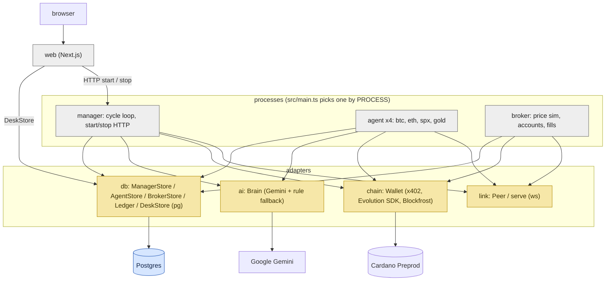
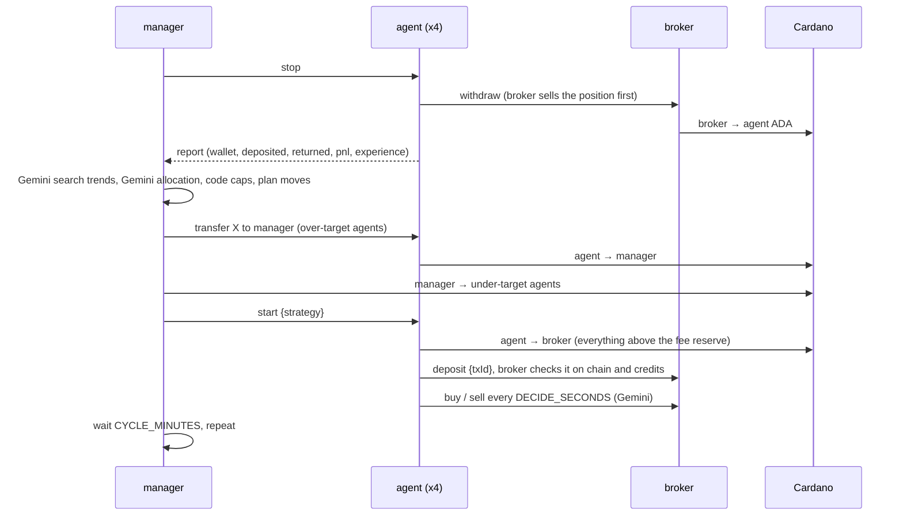

# Layers

Gray boxes are processes. Yellow boxes hide a third-party API behind a small interface. Blue is the database.

Types for each layer live in `interface.ts`: `src/common/interface.ts` (domain and socket messages), `src/db/interface.ts`, `src/chain/interface.ts`, `src/ai/interface.ts`, `src/link/interface.ts`, `web/interface.ts`. Only `src/db/pg.ts` imports `pg`, only `src/chain/` imports x402, only `src/ai/gemini.ts` calls Gemini, only `src/link/ws.ts` imports `ws`.

## One cycle

